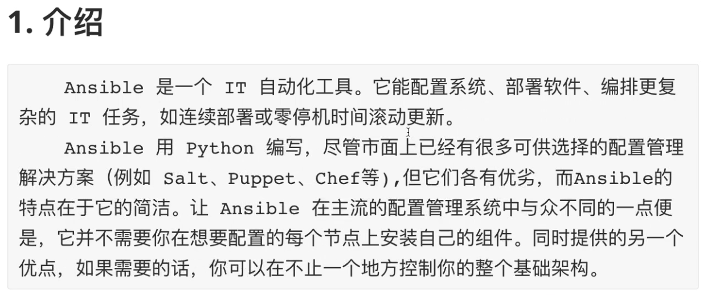
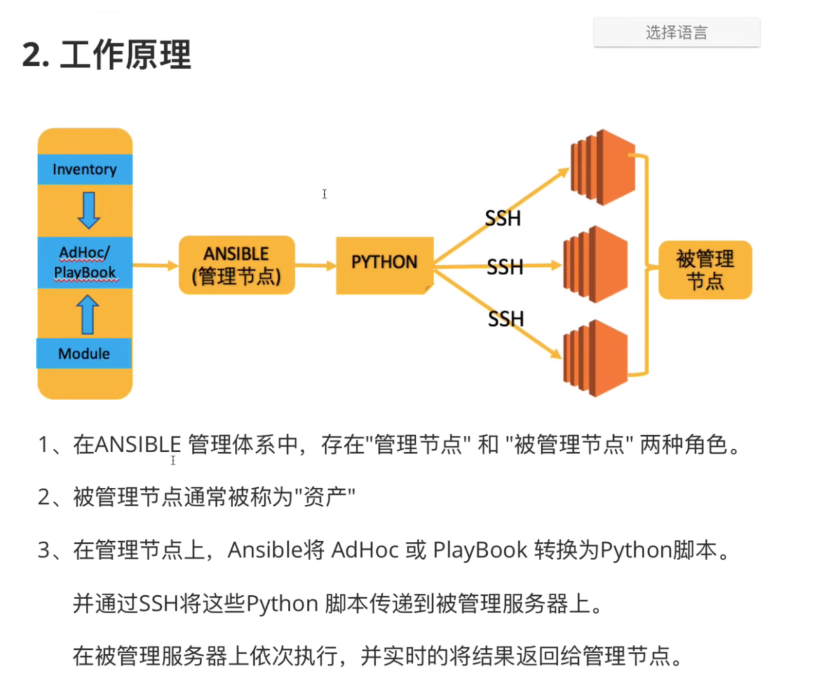

```javascript
ansible 不需要在被管理的机器上安装客户端程序，只需要服务端安装程序。
Salt 就是 client + server 模式, 被管理的机器上需要安装客户端程序。
```





```javascript
ansible原理：其实是把要执行的命令编程脚本通过SSH传到被管理节点上。

ansible 安装在管理节点，主要有以下模块：
  inventory：资产(也叫资源池)。就是被管理主机的列表。
  管理的方式：
	AdHoc：临时命令，就行执行一条 shell 命令。
	PlayBook：像 shell 编程中的脚本，把很多命令放在一起，并且加一些判断或循环，让被管理节点执行一些操作。
  Module：不管是 AdHoc 还是 PlayBook，这里去执行某些功能都不是一个个命令，都是已经被封装好的模块。
  
什么是封装好的模块？
比如说执行命令有个 shell 模块，这个 shell 模块专门执行 shell 命令。

ansible 中模块的概念：
    ansible 的每一个功能都封装成一个模块(这些模块其实就是一系列文件),选择模块加上参数就可以用这个功能。
    比如把管理模块的一个文件同时拷贝到被管理节点(不管被管理节点是一个还是多个都可以选择)，拷贝文件就要用拷贝模块去执行相应的拷贝操作。

```

