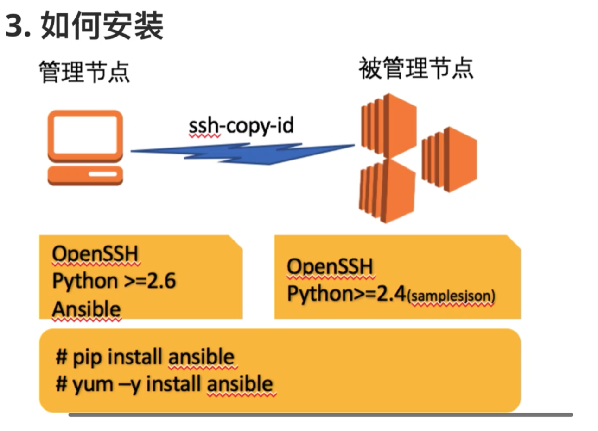
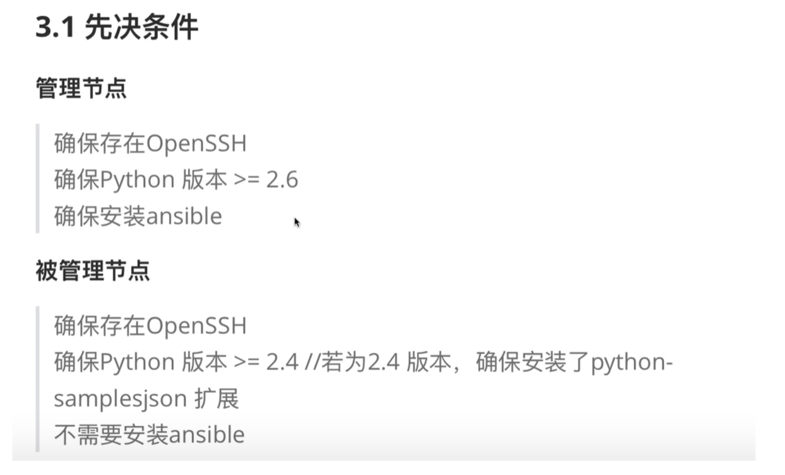
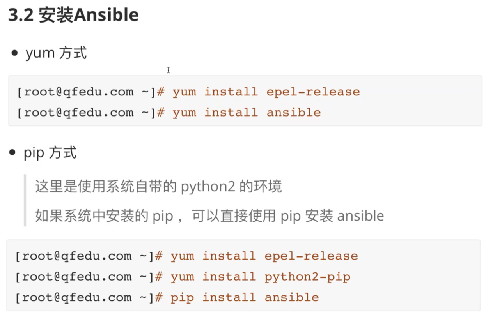
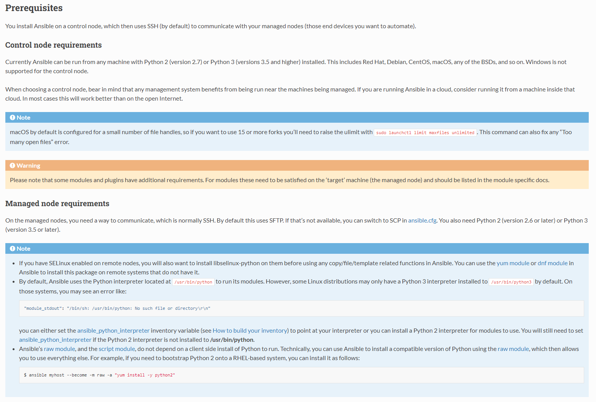

```javascript
centos6 自带的 python 版本应该是 2.6
centos6 自带的 python 版本应该是 2.7
ansible新增加的热模块,被管理节点不安装python也能执行一些相关命令,这个用的不多.
```




```javascript
PIP 是 Python包管理工具
```


1. 环境准备

管理节点：

- IAC-CentOS-7-x64


被管理节点：

- IAC-CentOS-7-x64-master

- IAC-CentOS-7-x64-node

```javascript
// 管理节点
[root@localhost /]# hostname -i
::1 127.0.0.1 192.168.32.99
[root@localhost /]# hostname
localhost.localdomain

// 被管理节点
[root@centos7 aaron]# hostname -i
127.0.0.1 192.168.32.100
[root@centos7 /]# hostname
centos7.master

[root@centos7 ~]# hostname -i
127.0.0.1 192.168.32.101
[root@centos7 ~]# hostname
centos7.node
```


2. 安装 Ansible 2.9，这里使用 yum 方式安装

```javascript
安装文档:
https://docs.ansible.com/ansible/2.9/installation_guide/intro_installation.html
```





安装 Ansible 2.9 ，需要满足以下要求:

- 控制节点的  Python 需要 Python 2 (version 2.7) or Python 3 (versions 3.5 and higher)。

- 被管理的节点 Python 需要 Python 2 (version 2.6 or later) or Python 3 (version 3.5 or later)。

```javascript
// 查看管理节点 Python 版本：
[root@localhost /]# python -V
Python 2.7.5

// 查看被管理节点 Python 版本：
[root@centos7 /]# python -V
Python 2.7.5
[root@centos7 ~]# python -V
Python 2.7.5

// 安装 Ansible 2.9, 在管理节点运行下面命令：
[root@localhost /]# yum install ansible

// 安装后,查看 ansible 版本以及相关配置的路径
[root@localhost /]# ansible --version
ansible 2.9.27
  config file = /etc/ansible/ansible.cfg
  configured module search path = [u'/root/.ansible/plugins/modules', u'/usr/share/ansible/plugins/modules']
  ansible python module location = /usr/lib/python2.7/site-packages/ansible
  executable location = /usr/bin/ansible
  python version = 2.7.5 (default, Oct 14 2020, 14:45:30) [GCC 4.8.5 20150623 (Red Hat 4.8.5-44)]
 
// ansible 的配置路径说明：    
// config file是配置文件，一般情况下不会动，优化的时候，有特殊需求的时候会动
// configured module search path 是模块路径,前面是系统的模块路径，后面是当前用户的模块路径
// ansible python module location 是 python模块路径
// executable location 是 ansible 命令(可执行文件)的路径  
```


```javascript
// 如果要升级 python 版本,参考以下文档：
CentOS7 下升级Python版本: https://www.cnblogs.com/ech2o/p/11748464.html

// 如果要安装 gcc,参考以下文档：
https://blog.csdn.net/ly_qiu/article/details/107013795
```

