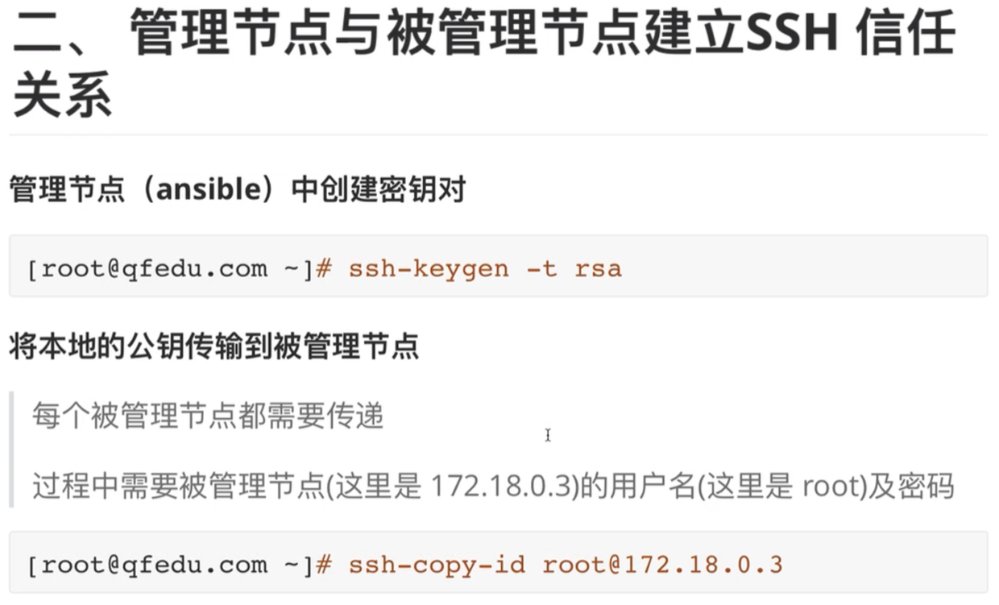

```javascript
// 在管理节点运行如下命令:
[root@localhost /]# ssh-keygen -t rsa
Generating public/private rsa key pair.
Enter file in which to save the key (/root/.ssh/id_rsa): 
Created directory '/root/.ssh'.
Enter passphrase (empty for no passphrase): 
Enter same passphrase again: 
Your identification has been saved in /root/.ssh/id_rsa.
Your public key has been saved in /root/.ssh/id_rsa.pub.
The key fingerprint is:
SHA256:NHotRQlw/T4RWvE0fvCJfRCajBcH4VA9HlDiDHAaJwg root@localhost.localdomain
The key's randomart image is:
+---[RSA 2048]----+
|    E..o*+*oOBO. |
|      .. BoOoX*=.|
|        + o+O+o=+|
|       o +..o ...|
|      . S .. .   |
|       . .  o    |
|             .   |
|                 |
|                 |
+----[SHA256]-----+

// root 是 192.168.32.100 这台主机的用户名,在建立 SSH 的过程中还需要输入主机的密码
[root@localhost /]# ssh-copy-id root@192.168.32.100
/usr/bin/ssh-copy-id: INFO: Source of key(s) to be installed: "/root/.ssh/id_rsa.pub"
The authenticity of host '192.168.32.100 (192.168.32.100)' can't be established.
ECDSA key fingerprint is SHA256:TcIIiLI+VCMoPspFCqRZHywv50EB/CMwDoIk6RxTB50.
ECDSA key fingerprint is MD5:43:cb:24:f0:02:26:58:6c:cf:1b:56:67:e5:50:be:30.
// 这里表示要不要接收对方主机的公钥
Are you sure you want to continue connecting (yes/no)? yes
/usr/bin/ssh-copy-id: INFO: attempting to log in with the new key(s), to filter out any that are already installed
/usr/bin/ssh-copy-id: INFO: 1 key(s) remain to be installed -- if you are prompted now it is to install the new keys
root@192.168.32.100's password: 

Number of key(s) added: 1

Now try logging into the machine, with:   "ssh 'root@192.168.32.100'"
and check to make sure that only the key(s) you wanted were added.

// 和 192.168.32.101 这台主机建立 SSH 信任关系
[root@localhost /]# ssh-copy-id root@192.168.32.101
/usr/bin/ssh-copy-id: INFO: Source of key(s) to be installed: "/root/.ssh/id_rsa.pub"
The authenticity of host '192.168.32.101 (192.168.32.101)' can't be established.
ECDSA key fingerprint is SHA256:TcIIiLI+VCMoPspFCqRZHywv50EB/CMwDoIk6RxTB50.
ECDSA key fingerprint is MD5:43:cb:24:f0:02:26:58:6c:cf:1b:56:67:e5:50:be:30.
Are you sure you want to continue connecting (yes/no)? yes
/usr/bin/ssh-copy-id: INFO: attempting to log in with the new key(s), to filter out any that are already installed
/usr/bin/ssh-copy-id: INFO: 1 key(s) remain to be installed -- if you are prompted now it is to install the new keys
root@192.168.32.101's password: 

Number of key(s) added: 1

Now try logging into the machine, with:   "ssh 'root@192.168.32.101'"
and check to make sure that only the key(s) you wanted were added.

// 可以用下面的命令测试是否能连接到被管理节点的主机：
 ssh 'root@192.168.32.100'
 ssh 'root@192.168.32.101'
// 使用上面的命令连接到被管理节点的主机后,可以使用 exit 命令退出。
```

