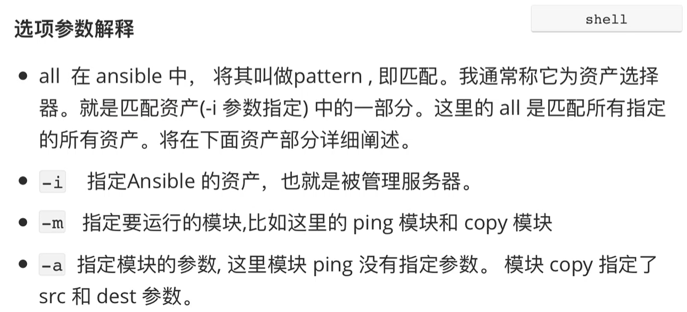

1. 当前环境

- 管理节点IP：192.168.32.99

- 被管理节点IP(资产)：192.168.32.100；192.168.32.101

```javascript
注意：
ansible 并不是交互性的，交互性就是比如登录linux主机时提示输入密码
```


2. 快速入门


2.1 场景一：

```javascript
// 在管理节点上,测试与所有被管理节点的网络连通性
// all 表示所有的主机(资产), -i 就是 inventory, 后面指定主机(资产)
// ping 就是一个模块，模块用 -m 参数执行
[root@localhost /]# ansible all -i 192.168.32.100,192.168.32.101 -m ping
192.168.32.101 | SUCCESS => {
    "ansible_facts": {
        "discovered_interpreter_python": "/usr/bin/python"
    }, 
    "changed": false, 
    "ping": "pong"
}
192.168.32.100 | SUCCESS => {
    "ansible_facts": {
        "discovered_interpreter_python": "/usr/bin/python"
    }, 
    "changed": false, 
    "ping": "pong"
}

// 注意：
// -i 参数后面接的是一个列表(List)。因此只操作一个被管理节点时,后面一定要加一个英文逗号(,)告知是 List
[root@localhost /]# ansible all -i 192.168.32.100, -m ping
192.168.32.100 | SUCCESS => {
    "ansible_facts": {
        "discovered_interpreter_python": "/usr/bin/python"
    }, 
    "changed": false, 
    "ping": "pong"
}

// 返回值说明：
// SUCCESS 表示返回的状态，SUCCESS 后面时返回的具体数据。
// discovered_interpreter_python 是被管理节点的 python 接收器所在的位置。
// 如果修改了被管理节点的数据(比如说创建或改变文件、权限、用户)，这里的changed的值就是true，否则为false。
// "ping": "pong" 表示 ping 的返回值是 pong。
```


2.2 场景二：在管理节点上,确保文件 /tmp/a.conf 发布到所有被管理节点

```javascript
// 以下命令在管理节点上运行
[root@localhost /]# touch /tmp/a.conf
// -i 也可以指定一个文件，可以把被管理节点放到这个文件中。
// -a 是 copy 模块的一个参数,src是管理节点的路径,dest是被管理节点的路径。
// -m 指定模块,想实现什么功能就用什么模块。
// 执行命令后,返回的被管理节点信息没有顺序,不一定谁先返回。
[root@localhost /]# ansible all -i 192.168.32.100,192.168.32.101 -m copy -a "src=/tmp/a.conf dest=/tmp/a.conf"
192.168.32.101 | CHANGED => {
    "ansible_facts": {
        "discovered_interpreter_python": "/usr/bin/python"
    }, 
    "changed": true, 
    "checksum": "da39a3ee5e6b4b0d3255bfef95601890afd80709", 
    "dest": "/tmp/a.conf", 
    "gid": 0, 
    "group": "root", 
    "md5sum": "d41d8cd98f00b204e9800998ecf8427e", 
    "mode": "0644", 
    "owner": "root", 
    "secontext": "unconfined_u:object_r:admin_home_t:s0", 
    "size": 0, 
    "src": "/root/.ansible/tmp/ansible-tmp-1649954863.04-23421-197790411579973/source", 
    "state": "file", 
    "uid": 0
}
192.168.32.100 | CHANGED => {
    "ansible_facts": {
        "discovered_interpreter_python": "/usr/bin/python"
    }, 
    "changed": true, 
    "checksum": "da39a3ee5e6b4b0d3255bfef95601890afd80709", 
    "dest": "/tmp/a.conf", 
    "gid": 0, 
    "group": "root", 
    "md5sum": "d41d8cd98f00b204e9800998ecf8427e", 
    "mode": "0644", 
    "owner": "root", 
    "secontext": "unconfined_u:object_r:admin_home_t:s0", 
    "size": 0, 
    "src": "/root/.ansible/tmp/ansible-tmp-1649954863.05-23419-109713083279428/source", 
    "state": "file", 
    "uid": 0
}

// 运行命令后的返回信息说明:
//   可以看到状态变为 CHANGED ,且 changed 的值是 true。
//   checksum 是 md5 校验值。
//   gid是组id，group 表示属组是谁，拷贝过去之后这个文件属于谁。
//   mode：拷贝过去这个文件的权限
//   owner：文件的所有者
//   size：文件的大小
//   src：是服务端(就是安装ansible这一端)的临时的脚本，这个脚本会发送到被管理端，然后让被管理端执行,用完后就自动删除了

// 在 192.168.32.100 节点上运行
[aaron@centos7 ~]$ ls /tmp | grep a.conf
a.conf

// 在 192.168.32.101 节点上运行
[aaron@centos7 ~]$ ls /tmp | grep a.conf
a.conf

// 管理节点放置脚本的临时目录,这个脚本运行后就自动删除
[root@localhost tmp]# pwd
/root/.ansible/tmp
[root@localhost tmp]# ls -a
.  ..
// 被管理节点也有放置脚本的临时目录，脚本运行后就自动删除
[root@centos7 ~]# ls -a /root/.ansible/tmp/
.  ..
```




总结：ansible 就是用什么模块，让谁去干什么事情。


