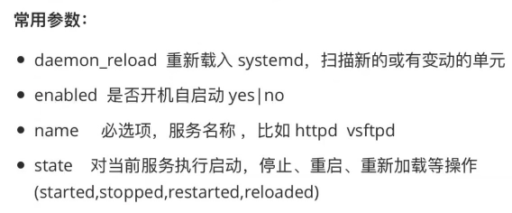

1. systemd模块

如果向 systemd 中添加一些自定义的服务，比如是编译安装的nginx 默认不能被systemd管理，如果想被systemd管理就要添加服务单元，这个时候就要重新reload才能管理它。


Centos6 之前的版本使用 service 模块。


管理远程节点的 systemd 服务,就是由 systemd 所管理的服务。




```javascript
// 重新加载 systemd
[root@localhost ~]# ansible master -i hosts -m systemd -a "daemon_reload=yes"
192.168.32.100 | SUCCESS => {
    "ansible_facts": {
        "discovered_interpreter_python": "/usr/bin/python"
    }, 
    "changed": false, 
    "name": null, 
    "status": {}
}

// 比如启动 nginx 服务, 多次运行不会返回启动，因为是等幂操作
// 注意参数 name: name 不是软件包名称，而是服务名称, 比如'systemctl start sshd',这个 sshd 就是服务的名称 
[root@localhost ~]# ansible master -i hosts -m systemd -a "name=nginx state=started"
192.168.32.100 | CHANGED => {
    "ansible_facts": {
        "discovered_interpreter_python": "/usr/bin/python"
    }, 
    "changed": true, 
    "name": "nginx", 
    "state": "started", 
    "status": {
        "ActiveEnterTimestampMonotonic": "0",
        // 省略......
    }
}

[root@localhost ~]# ansible master -i hosts -m shell -a "curl localhost"
[WARNING]: Consider using the get_url ......
192.168.32.100 | CHANGED | rc=0 >>
<!DOCTYPE html>
<html>
// 省略......
<h1>Welcome to nginx!</h1>
<p>If you see this page, the nginx web server is successfully installed and
working. Further configuration is required.</p>
// 省略......
</html>

// 比如关闭 nginx 服务
[root@localhost ~]# ansible master -i hosts -m systemd -a "name=nginx state=stopped"
192.168.32.100 | CHANGED => {
    "ansible_facts": {
        "discovered_interpreter_python": "/usr/bin/python"
    }, 
    "changed": true, 
    "name": "nginx", 
    "state": "stopped", 
    "status": {
        "ActiveEnterTimestamp": "Sun 2022-05-01 02:51:19 EDT",
        省略......
    }
}

// 比如重启 nginx 服务
// 重启永远都是改变了的
ansible master -i hosts -m systemd -a "name=nginx state=restarted"

// 比如重新加载 nginx 服务,重新加载永远都是为true
// 重新加载依赖于这个服务是否支持，比如 mysql 不支持重新加载 
ansible master -i hosts -m systemd -a "name=nginx state=reloaded"

// 比如将 nginx 服务设置为开机启动，添加参数 enabled=yes
ansible master -i hosts -m systemd -a "name=nginx enabled=yes"

```


```javascript
// 删除 nginx
[root@localhost ~]# ansible master -i hosts -m yum -a "name=nginx state=removed"
192.168.32.100 | CHANGED => {
    "ansible_facts": {
        "discovered_interpreter_python": "/usr/bin/python"
    }, 
    "changed": true, 
    "changes": {
        "removed": [
            "nginx"
        ]
    }, 
    "msg": "", 
    "rc": 0, 
    "results": [
        "Loaded plugins: ......
    ]
}

```


其它 linux 命令：

```javascript
查看nignx有没有被安装：  
rpm -q  nginx

查看服务状态：
systemctl status nginx

启动服务：
systemctl status nginx
```

