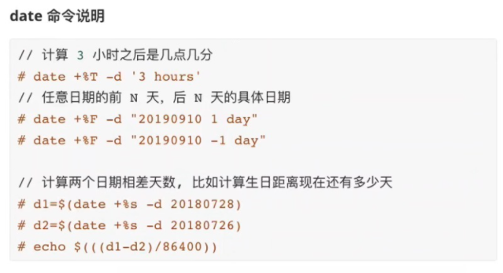

1. group模块

在被管理节点上，对组进行管理。


```javascript
// 创建普通组 db_admin
[root@localhost ~]# ansible master -i hosts -m group -a "name=db_admin"
192.168.32.100 | CHANGED => {
    "ansible_facts": {
        "discovered_interpreter_python": "/usr/bin/python"
    }, 
    "changed": true, 
    "gid": 1001, 
    "name": "db_admin", 
    "state": "present", 
    "system": false
}

// 可以看到 db_admin 已经创建
[root@localhost ~]# ansible master -i hosts -m shell -a "tail /etc/group"
192.168.32.100 | CHANGED | rc=0 >>
postfix:x:89:
chrony:x:996:
aaron:x:1000:aaron
cgred:x:995:
docker:x:994:
ntp:x:38:
rpc:x:32:
rpcuser:x:29:
nfsnobody:x:65534:
db_admin:x:1001:
```


2. user 模块，用于在被管理节点上对用户进行管理


```javascript
// 创建用户并设置密码,一定要使用加密的密码,所以首先生成加密密码
[root@localhost ~]# pass=$(echo "123456" | openssl passwd -1 -stdin)
[root@localhost ~]# echo $pass
$1$qtVRlDpJ$GGdE8DkKvWxfJs/in6zou.

// 执行 ansible 命令创建用户 foo 并设置密码
[root@localhost ~]# ansible master -i hosts -m user -a "name=foo password=${pass}"
192.168.32.100 | CHANGED => {
    "ansible_facts": {
        "discovered_interpreter_python": "/usr/bin/python"
    }, 
    "changed": true, 
    "comment": "", 
    "create_home": true, 
    "group": 1002, 
    "home": "/home/foo", 
    "name": "foo", 
    "password": "NOT_LOGGING_PASSWORD", 
    "shell": "/bin/bash", 
    "state": "present", 
    "system": false, 
    "uid": 1001
}
// 如上"password": "NOT_LOGGING_PASSWORD" 表示不会显示密文或加密的值

// 验证
// 在Linux /etc/passwd文件中每个用户都有一个对应的记录行，它记录了这个用户的一些基本属性。系统管理员经常会接触到这个文件的修改以完成对用户的管理工作。
[root@localhost ~]# ansible master -i hosts -m shell -a "tail /etc/passwd"
192.168.32.100 | CHANGED | rc=0 >>
polkitd:x:999:998:User for polkitd:/:/sbin/nologin
sshd:x:74:74:Privilege-separated SSH:/var/empty/sshd:/sbin/nologin
postfix:x:89:89::/var/spool/postfix:/sbin/nologin
chrony:x:998:996::/var/lib/chrony:/sbin/nologin
aaron:x:1000:1000:aaron:/home/aaron:/bin/bash
ntp:x:38:38::/etc/ntp:/sbin/nologin
rpc:x:32:32:Rpcbind Daemon:/var/lib/rpcbind:/sbin/nologin
rpcuser:x:29:29:RPC Service User:/var/lib/nfs:/sbin/nologin
nfsnobody:x:65534:65534:Anonymous NFS User:/var/lib/nfs:/sbin/nologin
foo:x:1001:1002::/home/foo:/bin/bash

// /etc/shadow 文件，用于存储 Linux 系统中用户的密码信息，又称为“影子文件”
[root@localhost ~]# ansible master -i hosts -m shell -a "tail /etc/shadow"
192.168.32.100 | CHANGED | rc=0 >>
polkitd:!!:18859::::::
sshd:!!:18859::::::
postfix:!!:18859::::::
chrony:!!:18859::::::
aaron:$6$jNmykpMyEvH/zfBg$stWuLXJvrffHl0DcdK9nnGpSKgL5tTdNF8ODVjrfxKFEh8KSjiaBhj1KIfbqcbGZ37B01gnqAdgpjLNL4WGPV1::0:99999:7:::
ntp:!!:18861::::::
rpc:!!:18891:0:99999:7:::
rpcuser:!!:18891::::::
nfsnobody:!!:18891::::::
foo:$1$qtVRlDpJ$GGdE8DkKvWxfJs/in6zou.:19101:0:99999:7:::
```


```javascript
// 创建用户 foo2,并为其创建密钥对,并且密钥类型为 ecdsa
[root@localhost ~]# ansible master -i hosts -m user -a "name=foo2 generate_ssh_key=yes ssh_key_type=ecdsa"
192.168.32.100 | CHANGED => {
    "ansible_facts": {
        "discovered_interpreter_python": "/usr/bin/python"
    }, 
    "changed": true, 
    "comment": "", 
    "create_home": true, 
    "group": 1003, 
    "home": "/home/foo2", 
    "name": "foo2", 
    "shell": "/bin/bash", 
    "ssh_fingerprint": "256 SHA256:M5ilD0TAe6EvULxkX6z+Kev1p62QoNICpP15bIRpnF4 ansible-generated on centos7.master (ECDSA)", 
    "ssh_key_file": "/home/foo2/.ssh/id_ecdsa", 
    "ssh_public_key": "ecdsa-sha2-nistp256 AAAAE2VjZHNhLXNoYTItbmlzdHAyNTYAAAAIbmlzdHAyNTYAAABBBK+ADW25GyVAcpLHNkSUXwwoGbo2aVI0jIDeUVpXXAdFd6Drh6NncYX8yeVY32HSkhmhN5texweKNXOv5jCUnI0= ansible-generated on centos7.master", 
    "state": "present", 
    "system": false, 
    "uid": 1002
}

[root@localhost ~]# ansible master -i hosts -m shell -a "tail /etc/shadow"
192.168.32.100 | CHANGED | rc=0 >>
sshd:!!:18859::::::
postfix:!!:18859::::::
chrony:!!:18859::::::
aaron:$6$jNmykpMyEvH/zfBg$stWuLXJvrffHl0DcdK9nnGpSKgL5tTdNF8ODVjrfxKFEh8KSjiaBhj1KIfbqcbGZ37B01gnqAdgpjLNL4WGPV1::0:99999:7:::
ntp:!!:18861::::::
rpc:!!:18891:0:99999:7:::
rpcuser:!!:18891::::::
nfsnobody:!!:18891::::::
foo:$1$qtVRlDpJ$GGdE8DkKvWxfJs/in6zou.:19101:0:99999:7:::
foo2:!!:19101:0:99999:7:::
```


```javascript
// 创建用户 foo3,并且设置其有效期到2022年4月20日,并且加入到db_admin组,
// 不改变用户原有的组。
[root@localhost ~]# ansible master -i hosts -m user -a "name=foo3 expires=$(date +%s -d 20220420) groups=db_admin append=yes"
192.168.32.100 | CHANGED => {
    "ansible_facts": {
        "discovered_interpreter_python": "/usr/bin/python"
    }, 
    "changed": true, 
    "comment": "", 
    "create_home": true, 
    "group": 1004, 
    "groups": "db_admin", 
    "home": "/home/foo3", 
    "name": "foo3", 
    "shell": "/bin/bash", 
    "state": "present", 
    "system": false, 
    "uid": 1003
}

// 注意：要把用户加入到组, 在被管理节点必须首先要有这个组
[root@localhost ~]# ansible master -i hosts -m shell -a "tail /etc/group"
192.168.32.100 | CHANGED | rc=0 >>
cgred:x:995:
docker:x:994:
ntp:x:38:
rpc:x:32:
rpcuser:x:29:
nfsnobody:x:65534:
db_admin:x:1001:foo3
foo:x:1002:
foo2:x:1003:
foo3:x:1004:

// 验证
[root@localhost ~]# ansible master -i hosts -m shell -a "id foo3"
192.168.32.100 | CHANGED | rc=0 >>
uid=1003(foo3) gid=1004(foo3) groups=1004(foo3),1001(db_admin)

[root@localhost ~]# ansible master -i hosts -m shell -a "tail /etc/shadow"
192.168.32.100 | CHANGED | rc=0 >>
postfix:!!:18859::::::
chrony:!!:18859::::::
aaron:$6$jNmykpMyEvH/zfBg$stWuLXJvrffHl0DcdK9nnGpSKgL5tTdNF8ODVjrfxKFEh8KSjiaBhj1KIfbqcbGZ37B01gnqAdgpjLNL4WGPV1::0:99999:7:::
ntp:!!:18861::::::
rpc:!!:18891:0:99999:7:::
rpcuser:!!:18891::::::
nfsnobody:!!:18891::::::
foo:$1$qtVRlDpJ$GGdE8DkKvWxfJs/in6zou.:19101:0:99999:7:::
foo2:!!:19101:0:99999:7:::
foo3:!!:19101:0:99999:7::19102:
    
// foo3:!!:19101:0:99999:7::19102:    
// 19101 这个是创建的时间,单位为天,这个天数从1970年1月1日开始计算
// 19102 表示到了这一天账户就会过期,这个天数从1970年1月1日开始计算
```




