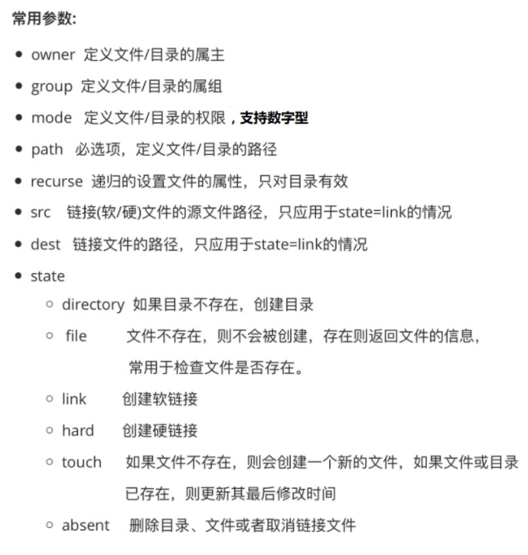

1. file模块：主要用于远程主机上的文件操作



```javascript
// 创建一个文件
[root@localhost ~]# ansible master -i hosts -m file -a "path=/tmp/foo.conf state=touch"
192.168.32.100 | CHANGED => {
    "ansible_facts": {
        "discovered_interpreter_python": "/usr/bin/python"
    }, 
    "changed": true, 
    "dest": "/tmp/foo.conf", 
    "gid": 0, 
    "group": "root", 
    "mode": "0644", 
    "owner": "root", 
    "secontext": "unconfined_u:object_r:user_tmp_t:s0", 
    "size": 0, 
    "state": "file", 
    "uid": 0
}

//  改变文件所有者及权限
[root@localhost ~]# ansible master -i hosts -m file -a "path=/tmp/foo.conf owner=aaron group=aaron mode=0644"
192.168.32.100 | CHANGED => {
    "ansible_facts": {
        "discovered_interpreter_python": "/usr/bin/python"
    }, 
    "changed": true, 
    "gid": 1000, 
    "group": "aaron", 
    "mode": "0644", 
    "owner": "aaron", 
    "path": "/tmp/foo.conf", 
    "secontext": "unconfined_u:object_r:user_tmp_t:s0", 
    "size": 0, 
    "state": "file", 
    "uid": 1000
}
```


```javascript
// 创建一个软连接
[root@localhost ~]# ansible master -i hosts -m file -a "src=/tmp/foo.conf dest=/tmp/link.conf state=link"
192.168.32.100 | CHANGED => {
    "ansible_facts": {
        "discovered_interpreter_python": "/usr/bin/python"
    }, 
    "changed": true, 
    "dest": "/tmp/link.conf", 
    "gid": 0, 
    "group": "root", 
    "mode": "0777", 
    "owner": "root", 
    "secontext": "unconfined_u:object_r:user_tmp_t:s0", 
    "size": 13, 
    "src": "/tmp/foo.conf", 
    "state": "link", 
    "uid": 0
}

[root@localhost ~]#  ansible master -i hosts -m shell -a  "ls -l /tmp"
192.168.32.100 | CHANGED | rc=0 >>
total 8
-rw-r--r--. 1 aaron aaron  0 Apr 19 03:43 foo.conf
lrwxrwxrwx. 1 root  root  13 Apr 19 03:46 link.conf -> /tmp/foo.conf
// 省略......


// 取消一个连接(不管是硬衔接还是软衔接)
[root@localhost ~]# ansible master -i hosts -m file -a "path=/tmp/link.conf state=absent"
192.168.32.100 | CHANGED => {
    "ansible_facts": {
        "discovered_interpreter_python": "/usr/bin/python"
    }, 
    "changed": true, 
    "path": "/tmp/link.conf", 
    "state": "absent"
}

// 删除一个文件
[root@localhost ~]# ansible master -i hosts -m file -a "path=/tmp/foo.conf state=absent"
192.168.32.100 | CHANGED => {
    "ansible_facts": {
        "discovered_interpreter_python": "/usr/bin/python"
    }, 
    "changed": true, 
    "path": "/tmp/foo.conf", 
    "state": "absent"
}

[root@localhost ~]# ansible master -i hosts -m shell -a  "ls -l /tmp"
192.168.32.100 | CHANGED | rc=0 >>
total 8
-rw-r--r--. 1 root  root  0 Apr 14 12:47 a.conf
drwx------. 2 root  root 41 Apr 19 03:55 ansible_command_payload_MYT25E
drwx------. 3 root  root 17 Apr 19 00:54 systemd-private-dc3fb44ca9134a0ba699f8a0114dcaf7-chronyd.service-SaKlWO
// 省略......

// 为什么这里不管增加还是删除操作后,这里的 total 始终是 8 ?
```


```javascript
// 创建一个目录
[root@localhost ~]# ansible master -i hosts -m file -a "path=/tmp/testdir state=directory"
192.168.32.100 | CHANGED => {
    "ansible_facts": {
        "discovered_interpreter_python": "/usr/bin/python"
    }, 
    "changed": true, 
    "gid": 0, 
    "group": "root", 
    "mode": "0755", 
    "owner": "root", 
    "path": "/tmp/testdir", 
    "secontext": "unconfined_u:object_r:user_tmp_t:s0", 
    "size": 6, 
    "state": "directory", 
    "uid": 0
}

[root@localhost ~]# ansible master -i hosts -m shell -a  "ls -l /tmp"
192.168.32.100 | CHANGED | rc=0 >>
total 8
drwxr-xr-x. 2 root  root  6 Apr 19 04:00 testdir
// 省略......

// 删除一个目录
[root@localhost ~]# ansible master -i hosts -m file -a "path=/tmp/testdir state=absent"
192.168.32.100 | CHANGED => {
    "ansible_facts": {
        "discovered_interpreter_python": "/usr/bin/python"
    }, 
    "changed": true, 
    "path": "/tmp/testdir", 
    "state": "absent"
}

```

