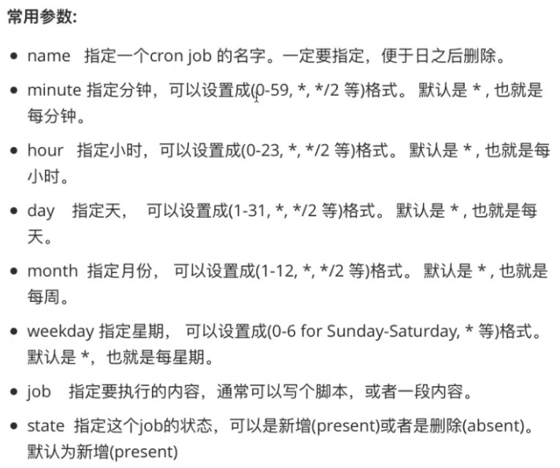

1. cron模块，管理远程节点的 CRON 服务。等同于 Linux 中的计划任务。

注意：使用 Ansible 创建的计划任务，是不能使用本地 crontab -e 去编辑，否则 Ansible 无法再次操作此计划任务。



```javascript
// 创建 cron
// name 一定要指定,不指定的话之后ansible就不能去管理它
[root@localhost ~]# ansible master -i hosts -m cron -a "name='create new job' minute='0' job='ls -a1h > /dev/null'"
192.168.32.100 | CHANGED => {
    "ansible_facts": {
        "discovered_interpreter_python": "/usr/bin/python"
    }, 
    "changed": true, 
    "envs": [], 
    "jobs": [
        "create new job"
    ]
}

// 补充：
// 在创建计划任务时,可以使用英文指定星期,但一般情况都是输入数字指定星期,0代表周日.
```


```javascript
// 注意：docker 镜像里面没有安装 crontab 这个命令
// 验证 cron, 查看 cron 怎么执行
[root@localhost ~]#  ansible master -i hosts -m shell -a  "crontab -l"
192.168.32.100 | CHANGED | rc=0 >>
#Ansible: create new job
0 * * * * ls -a1h > /dev/null


//  删除corn, 一定要正确指定 job 的 name 参数,以免误删除
[root@localhost ~]# ansible master -i hosts -m cron -a "name='create new job' state=absent"
192.168.32.100 | CHANGED => {
    "ansible_facts": {
        "discovered_interpreter_python": "/usr/bin/python"
    }, 
    "changed": true, 
    "envs": [], 
    "jobs": []
}

```


```javascript
// 使用“rpm -qf /usr/bin/crontab”查看 cron 是哪个软件包安装的
[root@localhost ~]#  ansible master -i hosts -m shell -a  "rpm -qf /usr/bin/crontab"
[WARNING]: Consider using the yum, dnf or zypper module rather than running 'rpm'.  If you need to use command because yum, dnf or zypper is
insufficient you can add 'warn: false' to this command task or set 'command_warnings=False' in ansible.cfg to get rid of this message.
192.168.32.100 | CHANGED | rc=0 >>
cronie-1.4.11-23.el7.x86_64
```

