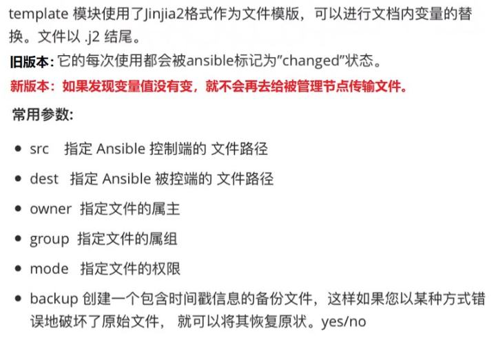

1. template模块



template 模块用法其实和 copy 模块基本一样, template 模块的强大之处就是使用变量替换, 就是可以把传递给 Ansible 的变量的值替换到模板文件中。

```javascript
// 在管理节点建立一个 template 文件, 名为 hello_world.j2
[root@localhost ~]# echo hello {{var}}! > ./hello_world.j2
[root@localhost ~]# cat ./hello_world.j2 
hello {{var}}!
[root@localhost ~]# pwd
/root

// 设置 var 的值为 world
// 如果多次传递一样的变量去运行,ansible 发现变量的值没变,就不会再去传输了
[root@localhost ~]# ansible master -i hosts -m template -a "src=hello_world.j2 dest=/tmp/hello_world.world" -e "var=world"
192.168.32.100 | CHANGED => {
    "ansible_facts": {
        "discovered_interpreter_python": "/usr/bin/python"
    }, 
    "changed": true, 
    "checksum": "f951b101989b2c3b7471710b4e78fc4dbdfa0ca6", 
    "dest": "/tmp/hello_world.world", 
    "gid": 0, 
    "group": "root", 
    "md5sum": "c897d1410af8f2c74fba11b1db511e9e", 
    "mode": "0644", 
    "owner": "root", 
    "secontext": "unconfined_u:object_r:admin_home_t:s0", 
    "size": 13, 
    "src": "/root/.ansible/tmp/ansible-tmp-1650358427.16-3140-78016649783498/source", 
    "state": "file", 
    "uid": 0
}

// 在被管理节点(192.168.32.100)上验证
[root@localhost ~]#  ansible master -i hosts -m shell -a  "cat /tmp/hello_world.world"
192.168.32.100 | CHANGED | rc=0 >>
hello world!
```

