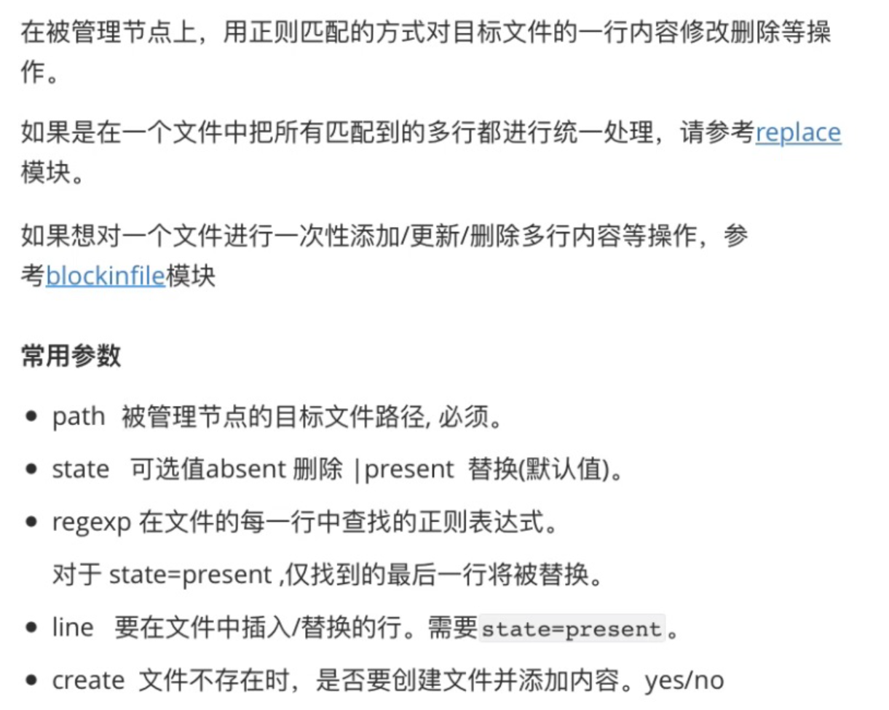

1. lineinfile 模块



```javascript
// 在被管理节点(192.168.32.100)准备如下文件：
[root@centos7 aaron]# vi /tmp/tempfile.txt 

[root@centos7 aaron]# cat /tmp/tempfile.txt 
hello c
c++
hello java
kubernetes
kubernetes
hello dokcer
hello python
goland
hello kubernetes

// 删除匹配到的行
[root@localhost ~]# ansible master -i hosts -m lineinfile -a "path=/tmp/tempfile.txt regexp='^hello' state=absent"
192.168.32.100 | CHANGED => {
    "ansible_facts": {
        "discovered_interpreter_python": "/usr/bin/python"
    }, 
    "backup": "", 
    "changed": true, 
    "found": 5, 
    "msg": "5 line(s) removed"
}

[root@localhost ~]# ansible master -i hosts -m shell -a "cat /tmp/tempfile.txt"
192.168.32.100 | CHANGED | rc=0 >>
c++
kubernetes
kubernetes
goland
```


```javascript
// 替换某一行,和 sed 命令差不都。注意：仅找到的最后一行将被替换
[root@localhost ~]# ansible master -i hosts -m lineinfile -a "path=/tmp/tempfile.txt regexp='^kubernetes' line='hello kubernetes' state=present"
192.168.32.100 | CHANGED => {
    "ansible_facts": {
        "discovered_interpreter_python": "/usr/bin/python"
    }, 
    "backup": "", 
    "changed": true, 
    "msg": "line replaced"
}

// 验证
[root@localhost ~]# ansible master -i hosts -m shell -a "cat /tmp/tempfile.txt"
192.168.32.100 | CHANGED | rc=0 >>
c++
kubernetes
hello kubernetes
goland

```


2. blockinfile 模块

```javascript
[root@localhost ~]# ansible-doc blockinfile
> BLOCKINFILE    (/usr/lib/python2.7/site-packages/ansible/modules/files/blockinfile.py)

        This module will insert/update/remove a block of multi-line text surrounded by customizable marker lines.

  * This module is maintained by The Ansible Core Team
OPTIONS (= is mandatory):

- attributes
// 省略 ......
```


```javascript
//  插入一个 block 块,默认会插入到文件最后,会自动添加注释
[root@localhost ~]# ansible master -i hosts -m blockinfile -a "path=/tmp/tempfile.txt block='hello java\nhello goland'"
192.168.32.100 | CHANGED => {
    "ansible_facts": {
        "discovered_interpreter_python": "/usr/bin/python"
    }, 
    "changed": true, 
    "msg": "Block inserted"
}

// 验证
[root@localhost ~]# ansible master -i hosts -m shell -a "cat /tmp/tempfile.txt"
192.168.32.100 | CHANGED | rc=0 >>
c++
kubernetes
hello kubernetes
goland
# BEGIN ANSIBLE MANAGED BLOCK
hello java
hello goland
# END ANSIBLE MANAGED BLOCK
```


```javascript
// 替换, 这里自动匹配, 不会再增加, 会直接修改
// 注意：blockinfile 模块, ansible只会替换自己管理的内容
[root@localhost ~]# ansible master -i hosts -m blockinfile -a "path=/tmp/tempfile.txt block='kubernetes\nhello k8s'"
192.168.32.100 | CHANGED => {
    "ansible_facts": {
        "discovered_interpreter_python": "/usr/bin/python"
    }, 
    "changed": true, 
    "msg": "Block inserted"
}

[root@localhost ~]# ansible master -i hosts -m shell -a "cat /tmp/tempfile.txt"
192.168.32.100 | CHANGED | rc=0 >>
c++
kubernetes
hello kubernetes
goland
# BEGIN ANSIBLE MANAGED BLOCK
kubernetes
hello k8s
# END ANSIBLE MANAGED BLOCK

```


```javascript
// 删除, ansible只会删除自己管理的内容
[root@localhost ~]# ansible master -i hosts -m blockinfile -a "path=/tmp/tempfile.txt block='kubernetes\nhello k8s' state=absent"
192.168.32.100 | CHANGED => {
    "ansible_facts": {
        "discovered_interpreter_python": "/usr/bin/python"
    }, 
    "changed": true, 
    "msg": "Block removed"
}

//验证
[root@localhost ~]# ansible master -i hosts -m shell -a "cat /tmp/tempfile.txt"
192.168.32.100 | CHANGED | rc=0 >>
c++
kubernetes
hello kubernetes
goland

// 也可以在被管理主机(192.168.32.100)上验证内容
[root@centos7 aaron]# tail /tmp/tempfile.txt
c++
kubernetes
hello kubernetes
goland

```


3. linux中 sudoedit 命令的用法

```javascript
// sudoedit 命令
sudoedit命令,可以以另外一个用户身份(非root身份)编辑 root权限文件。
参考资料: https://linux265.com/course/linux-command-sudoedit.html
```

