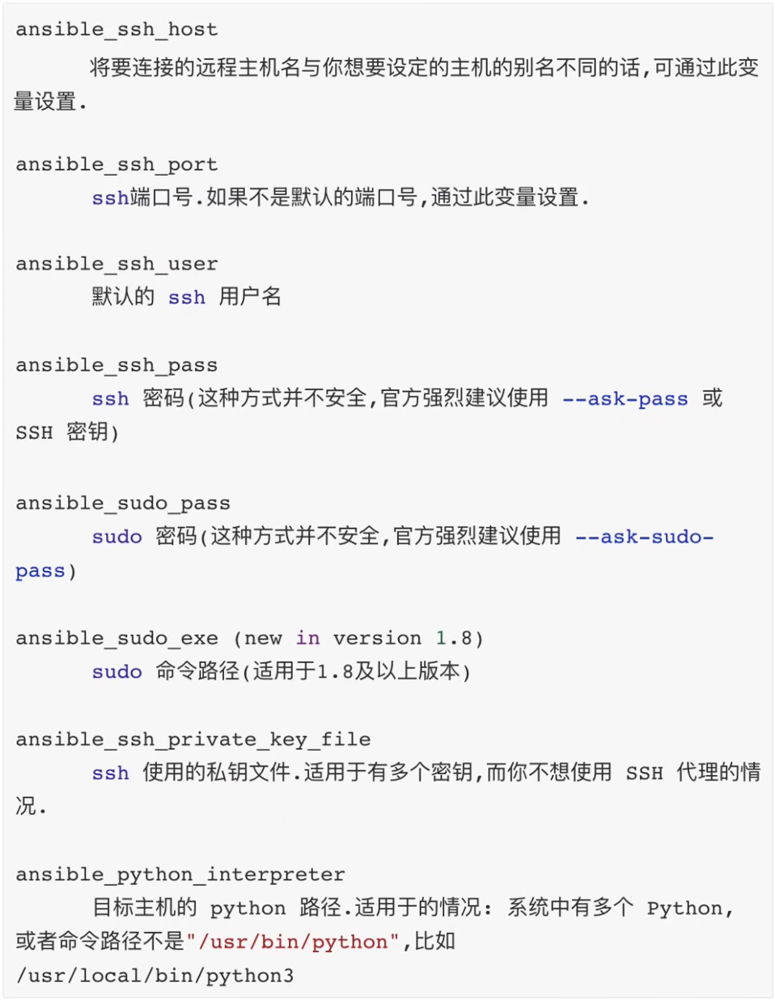

1. 介绍

资产分为静态资产和动态资产, 资产变量就是和资产紧密相关的一种变量, 资产变量分为主机变量和主机组变量。


2. 主机变量

```javascript
# cat hostsVars
# user 和 port 变量只是针对 192.168.32.100 这台主机有效。
[master]
192.168.32.100 user=lilei port=3309
192.168.32.101

```


使用多个变量获取定义的变量值：

```javascript
[root@localhost ~]# ansible 192.168.32.100 -i hostsVars -m debug -a "msg='{{user}} {{port}}'"
192.168.32.100 | SUCCESS => {
    "msg": "lilei 3309"
}

// 没有为 '192.168.32.101' 这台主机定义变量,所以这里运行失败
[root@localhost ~]# ansible 192.168.32.101 -i hostsVars -m debug -a "msg='{{user}} {{port}}'"
192.168.32.101 | FAILED! => {
    "msg": "The task includes an option with an undefined variable. The error was: 'user' is undefined"
}
```


使用一个变量获取定义的变量值：

```javascript
// var 在这里是属性,是固定写法
[root@localhost ~]# ansible 192.168.32.100 -i hostsVars -m debug -a "var=user"
192.168.32.100 | SUCCESS => {
    "user": "lilei"
}

[root@localhost ~]# ansible 192.168.32.101 -i hostsVars -m debug -a "var=user"
192.168.32.101 | SUCCESS => {
    "user": "VARIABLE IS NOT DEFINED!"
}
```


3. 主机组变量

```javascript
# cat hostsGroupVars
[master]
192.168.32.100 user=lilei
192.168.32.101

# ":vars" 是固定写法
[master:vars]
home="/home/lilei"
```


```javascript
[root@localhost ~]# ansible master -i hostsGroupVars -m debug -a "var=home"
192.168.32.100 | SUCCESS => {
    "home": "/home/lilei"
}
192.168.32.101 | SUCCESS => {
    "home": "/home/lilei"
}
```


如果主机变量和主机组变量在同一个资产中都有定义，主机变量的优先级更高!

```javascript
[master]
# 主机变量的优先级更高
192.168.32.100 user=lilei
192.168.32.101

[master:vars]
user=tom
```


4. 变量的继承

```javascript
# cat hostInheritVars
# allHost 继承 master 和 node, allHost 的变量也会反继承给 master 和 node
[master]
192.168.32.100

[node]
192.168.32.101

[allHost]
[allHost:children]
master
node

[allHost:vars]
user=lilei
```


```javascript
[root@localhost ~]# ansible allHost -i hostsInheritVars -m debug -a "var=user"
192.168.32.100 | SUCCESS => {
    "user": "lilei"
}
192.168.32.101 | SUCCESS => {
    "user": "lilei"
}
```


```javascript
// 在资产继承的同时,对应的变量也发生了继承(allHost 继承 master 和 node, allHost 的变量也会反继承给 master 和 node)
[root@localhost ~]# ansible master -i hostsInheritVars -m debug -a "var=user"
192.168.32.100 | SUCCESS => {
    "user": "lilei"
}

[root@localhost ~]# ansible node -i hostsInheritVars -m debug -a "var=user"
192.168.32.101 | SUCCESS => {
    "user": "lilei"
}
```


5. Inventory(资产)内置变量

内置变量几乎都是以 ansible_ 为前缀：




```javascript
# vi hostsInSelfVars
[master]
192.168.32.100

# 内置变量使用示例 (应用场景: 比如可以通过内置变量在资产中指定主机的 ssh 端口)
[node]
192.168.32.101 ansible_ssh_port=2222 ansible_ssh_user=shark

[allHost]
[allHost:children]
master
node

[allHost:vars]
user=lilei
```


```javascript
// 因为使用内置变量改变了 192.168.32.101 这台主机默认的 SSH 端口, 所以不能连接到这台主机
[root@localhost ~]# ansible allHost -i hostsInSelfVars -m shell -a "echo {{user}}"
192.168.32.100 | CHANGED | rc=0 >>
lilei
192.168.32.101 | UNREACHABLE! => {
    "changed": false, 
    "msg": "Failed to connect to the host via ssh: ssh: connect to host 192.168.32.101 port 2222: No route to host", 
    "unreachable": true
}
```


6. 补充

```javascript
// 开启 sshd 服务
/usr/sbin/sshd

// 查看 sshd 服务状态
systemctl stauts sshd

// 配置 sshd 服务,比如配置 端口
vi /etc/ssh/sshd_config

// 配置发生改变后, 重新开启 sshd 服务
systemctl restart sshd
```


```javascript
// 使用 sshd 登录主机 
[root@localhost ~]# ssh -p 22 root@192.168.32.99
Last login: Mon May  2 01:47:58 2022 from 192.168.32.1
[root@localhost ~]# exit
logout
Connection to 192.168.32.99 closed.
```


```javascript
// ssh代理默认使用的这个私钥
[root@localhost ~]# ls /root/.ssh/
authorized_keys  id_rsa  id_rsa.pub  known_hosts
[root@localhost ~]#

```

