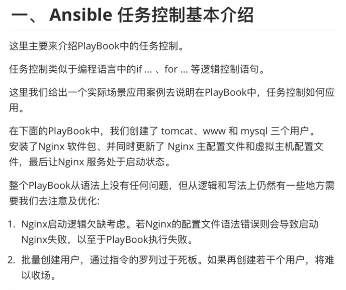

比如如下的 Playbook：

```javascript
# cat example.yml
---
- name: task control playbook example
  hosts: master
  tasks:
    - name: create tomcat user
      user: name=tomcat state=present

    - name: create www user
      user: name=www state=present

    - name: create mysql user
      user: name=mysql state=present
    
    - name: yum nginx master
      yum: name=nginx state=present

    - name: update nginx main config
      copy: src=nginx.conf dest=/etc/nginx/

    - name: add virtualhost config
      copy: src=www.example.com.conf dest=/etc/nginx/conf.d/

    - name: start nginx server
      systemd: name=nginx state=started
```


[nginx.conf](attachments/756FF6CBCA434B68884E3C06FBD68C3Anginx.conf)

```javascript
// cat nginx.conf
```


[www.example.com.conf](attachments/CBFC6407431A4F91A2B5F50415EEF6F3www.example.com.conf)

```javascript
// cat www.example.com.conf
```


```javascript
[root@localhost ~]# ansible-playbook -i hosts example.yml --syntax-check

playbook: example.yml
```

