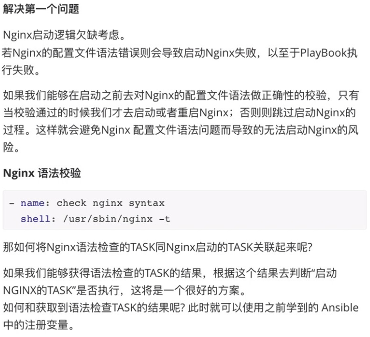
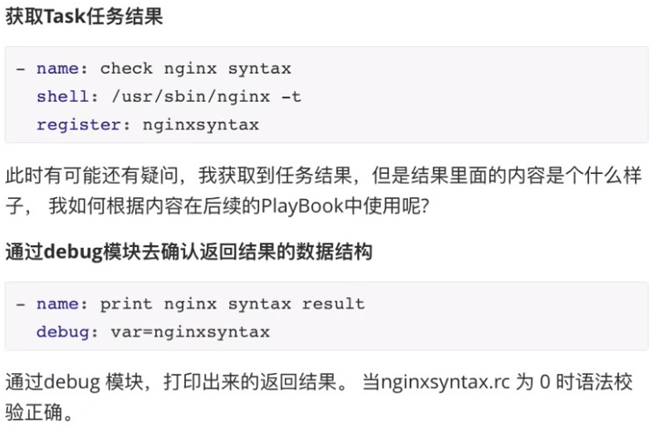
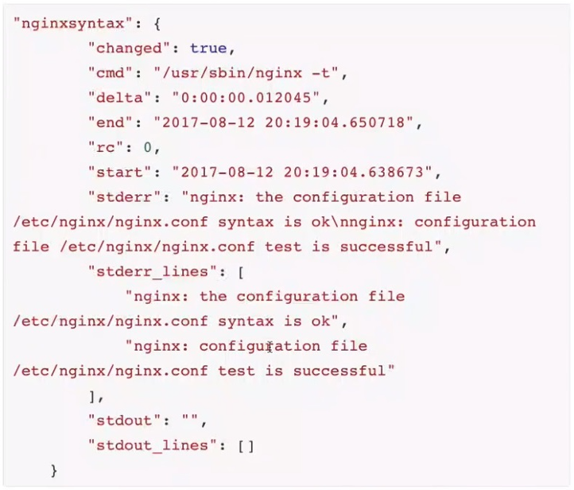
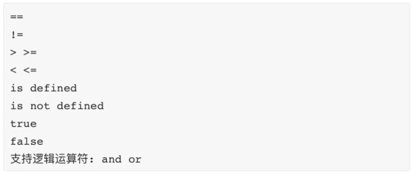

1. 任务控制-判断








2. 通过条件判断 when 指令实现判断

改进后的 Playbook：

```javascript
# cat example.yml
---
- name: task control playbook example
  hosts: master
  gather_facts: no
  tasks:
    - name: create tomcat user
      user: name=tomcat state=present

    - name: create www user
      user: name=www state=present

    - name: create mysql user
      user: name=mysql state=present

    - name: yum nginx master
      yum: name=nginx state=present

    - name: update nginx main config
      copy: src=nginx.conf dest=/etc/nginx/

    - name: add virtualhost config
      copy: src=www.example.com.conf dest=/etc/nginx/conf.d/
    
    - name: check nginx syntax
      # "/usr/sbin/nginx -t" 表示检查 nginx 的配置文件  
      shell: /usr/sbin/nginx -t
      register: nginx_syntax_result

    - name: print nginx syntax
      debug: var=nginx_syntax_result

    # when 条件判断和注册变量结合使用
    - name: start nginx server
      systemd: name=nginx state=started
      # 通过条件判断(when)指令去是使用语法校验的结果,只有语法检查通过才会执行"start nginx server"这个TASK
      when: nginx_syntax_result.rc == 0
```


[nginx.conf](attachments/D782C49837E54E5CA254FBE44EF94777nginx.conf)

[www.example.com.conf](attachments/4DF14A8B51EE47748DF4460955DC2A1Awww.example.com.conf)


```javascript
[root@localhost ~]# ansible-playbook -i hosts example.yml --syntax-check

playbook: example.yml
```


3. when 支持如下运算符, 通过这些运算符 when 条件判断中可以支持复杂逻辑。




