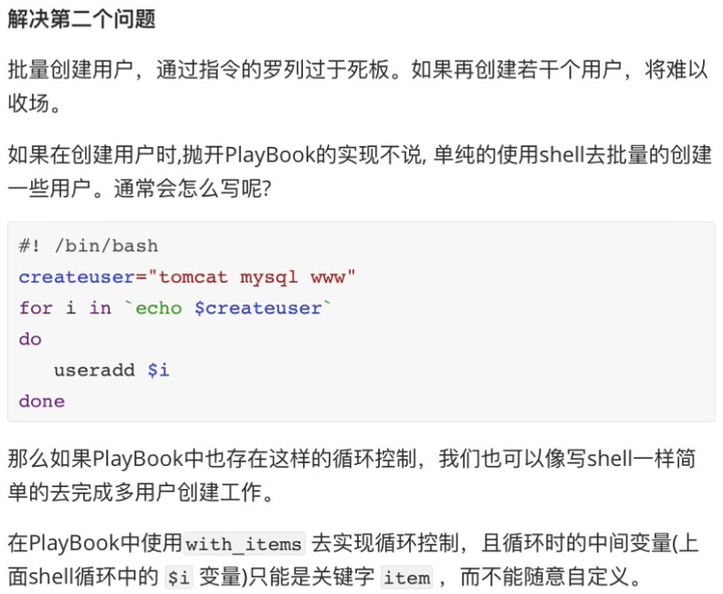

1. 任务控制-循环




2. 改进 Playbook

```javascript
# cat example-task-playbook-if-loop.yaml
---
- name: task control playbook example
  hosts: master
  gather_facts: no
  vars:
    createUser:
      - tomcat
      - www
      - mysql
  tasks:
    - name: create user
      user: name={{item}} state=present
      with_items: "{{createUser}}"

    - name: yum nginx master
      yum: name=nginx state=present

    - name: update nginx main config
      copy: src=nginx.conf dest=/etc/nginx/

    - name: add virtualhost config
      copy: src=www.example.com.conf dest=/etc/nginx/conf.d/
    
    - name: check nginx syntax
      shell: /usr/sbin/nginx -t
      register: nginx_syntax_result

    - name: print nginx syntax
      debug: var=nginx_syntax_result

    # when 条件判断和注册变量结合使用
    - name: start nginx server
      systemd: name=nginx state=started
      # 通过条件判断(when)指令去是使用语法校验的结果,只有语法检查通过才会执行"start nginx server"这个TASK
      when: nginx_syntax_result.rc == 0
```


[nginx.conf](attachments/E1C8714865BD49BE9EF3FE18EAB4C32Fnginx.conf)

[www.example.com.conf](attachments/13CC66F4B30B4256BEB7EE89E1153986www.example.com.conf)


```javascript
[root@localhost ~]# ansible-playbook -i hosts example.yml --syntax-check

playbook: example.yml
```


3. 新版本的循环

```javascript
# vi new_loop_example.yml
---
- name: new loop example
  hosts: master
  gather_facts: no
  vars:
    string_list:
      - "abc"
      - "bcd"
      - "cde"
    num_list:
      - 10
      - 20
      - 30
      - 50
  tasks:
    - name: show string item
      debug:
        var: "{{item}}"
      loop: "{{string_list}}"

    - name: show num item when item > 20
      debug:
        var: "{{item}}"
      loop: "{{num_list}}"
      when: item > 20
```


```javascript
[root@localhost ~]# ansible-playbook -i hosts new_loop_example.yml

PLAY [new loop example] **************************************......

TASK [show string item] **************************************......
ok: [192.168.32.100] => (item=abc) => {
    "abc": "VARIABLE IS NOT DEFINED!", 
    "ansible_loop_var": "item", 
    "item": "abc"
}
ok: [192.168.32.100] => (item=bcd) => {
    "ansible_loop_var": "item", 
    "bcd": "VARIABLE IS NOT DEFINED!", 
    "item": "bcd"
}
ok: [192.168.32.100] => (item=cde) => {
    "ansible_loop_var": "item", 
    "cde": "VARIABLE IS NOT DEFINED!", 
    "item": "cde"
}

TASK [show num item when item > 20] **************************......
skipping: [192.168.32.100] => (item=10) 
skipping: [192.168.32.100] => (item=20) 
ok: [192.168.32.100] => (item=30) => {
    "30": "VARIABLE IS NOT DEFINED!", 
    "ansible_loop_var": "item", 
    "item": 30
}
ok: [192.168.32.100] => (item=50) => {
    "50": "VARIABLE IS NOT DEFINED!", 
    "ansible_loop_var": "item", 
    "item": 50
}

PLAY RECAP ***************************************************......
192.168.32.100             : ok=2    changed=0    unreachable=0    failed=0    skipped=0    rescued=0    ignored=0   

[root@localhost ~]#
```

