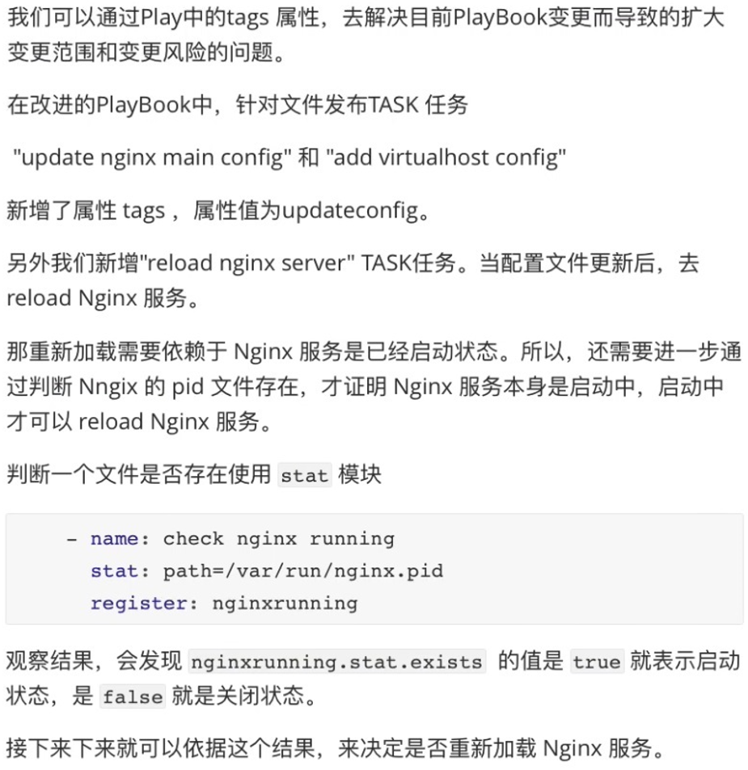

1. Tags 属性介绍





2. 改进 Playbook

```javascript
# cat example-task-playbook-tags.yaml
---
- name: tags playbook example
  hosts: master
  gather_facts: no
  vars:
    createUser:
      - tomcat
      - www
      - mysql
  tasks:
    - name: create user
      user: name={{item}} state=present
      with_items: "{{createUser}}"

    - name: yum nginx master
      yum: name=nginx state=present

    - name: update nginx main config
      copy: src=nginx.conf dest=/etc/nginx/
      tags: tag_update_config

    - name: add virtualhost config
      copy: src=www.example.com.conf dest=/etc/nginx/conf.d/
      tags: tag_update_config
    
    - name: check nginx syntax
      shell: /usr/sbin/nginx -t
      register: nginx_syntax_result
      tags: tag_update_config

    - name: check nginx running
      stat: path=/var/run/nginx.pid
      register: nginx_running_result
      tags: tag_update_config

    - name: print nginx syntax
      debug: var=nginx_syntax_result

    - name: print nginx running
      debug: var=nginx_running_result

    - name: reload nginx server
      systemd: name=nginx state=reloaded
      # when: nginx_syntax_result.rc == 0 and nginx_running_result.stat.exists == true
      # when 也可以用下面的方式表示 and 关系
      when:
        - nginx_syntax_result.rc == 0
        - nginx_running_result.stat.exists == true
      tags: tag_update_config

    - name: start nginx server
      systemd: name=nginx state=started
      when: nginx_syntax_result.rc == 0
      
```


指定 tags 执行 Playbook：

```javascript
[root@localhost ~]# ansible-playbook -i hosts example-task-playbook-tags.yaml --syntax-check

playbook: example-task-playbook-tags.yaml

// 执行时一定要指定 tags,这样在执行的过程中只会执行 task 任务上打上 tag 为 tag_update_config 的任务
[root@localhost ~]# ansible-playbook -i hosts example-task-playbook-tags.yaml -t tag_update_config

PLAY [tags playbook example] ****************************************************************************......

TASK [update nginx main config] *************************************************************************......
ok: [192.168.32.100]

TASK [add virtualhost config] ***************************************************************************......
changed: [192.168.32.100]

TASK [check nginx syntax] *******************************************************************************......
changed: [192.168.32.100]

TASK [check nginx running] ******************************************************************************......
ok: [192.168.32.100]

TASK [reload nginx server] ******************************************************************************......
ok: [192.168.32.100]

PLAY RECAP **********************************************************************************************......
192.168.32.100             : ok=5    changed=2    unreachable=0    failed=0    skipped=0    rescued=0    ignored=0 

[root@localhost ~]# 
```


3. handlers 属性


