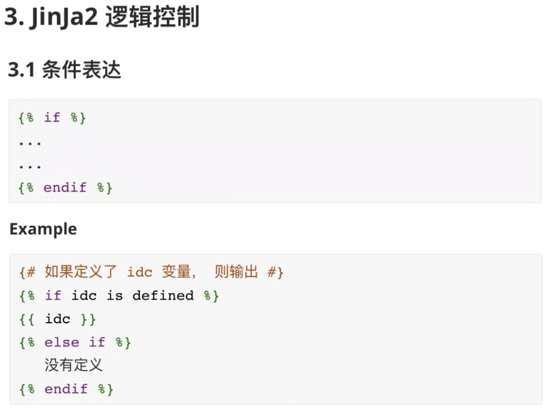
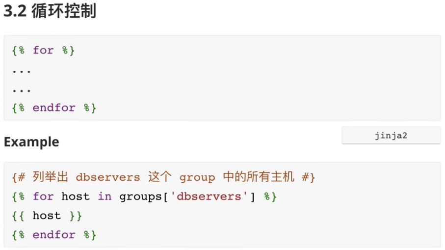
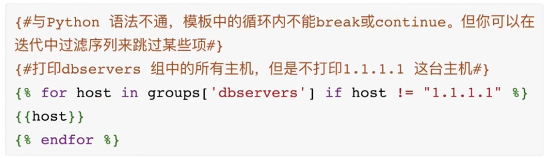
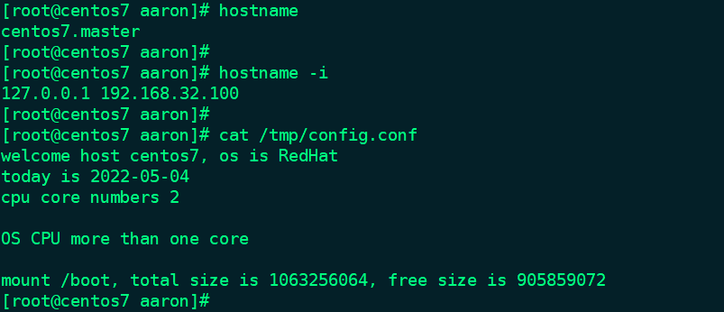

```javascript
# cat config.j2
{#user variable example#}
welcome host {{ansible_hostname}}, os is {{ansible_os_family}}
today is {{ansible_date_time.date}}
cpu core numbers {{ansible_processor_vcpus}}

{#use condition example#}

OS CPU more than one core



mount {{m['mount']}}, total size is {{m['size_total']}}, free size is {{m['size_available']}}

```


```javascript
# cat example-task-playbook-jinja2.yaml
---
- name: a template example
  hosts: master
  remote_user: root
  tasks:
    - name: update jinja2 config
      template: src=config.j2 dest=/tmp/config.conf
```


```javascript
[root@localhost ~]# ansible-playbook -i hosts example-task-playbook-jinja2.yaml

PLAY [a template example] *******************************************************************......

TASK [Gathering Facts] **********************************************************************......
ok: [192.168.32.100]

TASK [update jinja2 config] *****************************************************************......
changed: [192.168.32.100]

PLAY RECAP **********************************************************************************......
192.168.32.100             : ok=2    changed=1    unreachable=0    failed=0    skipped=0    rescued=0    ignored=0   

[root@localhost ~]# 

```


在 master 机器上验证：



