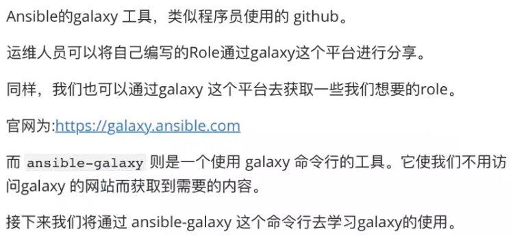

1. Galaxy 介绍



```javascript
https://galaxy.ansible.com/
```


```javascript
// 获取帮助, 可以看到 ansible-galaxy 主要是用来管理 collection 和 role 
[root@localhost ~]# ansible-galaxy --help
usage: ansible-galaxy [-h] [--version] [-v] TYPE ...

Perform various Role and Collection related operations.

positional arguments:
  TYPE
    collection   Manage an Ansible Galaxy collection.
    role         Manage an Ansible Galaxy role.

optional arguments:
  --version      show program's version number, config file location,
                 configured module search path, module location, executable
                 location and exit
  -h, --help     show this help message and exit
  -v, --verbose  verbose mode (-vvv for more, -vvvv to enable connection
                 debugging)


```


```javascript
// 查看管理 collection 的子命令
[root@localhost ~]# ansible-galaxy collection --help
usage: ansible-galaxy collection [-h] COLLECTION_ACTION ...

positional arguments:
  COLLECTION_ACTION
    init             Initialize new collection with the base structure of a
                     collection.
    build            Build an Ansible collection artifact that can be publish
                     to Ansible Galaxy.
    publish          Publish a collection artifact to Ansible Galaxy.
    install          Install collection(s) from file(s), URL(s) or Ansible
                     Galaxy

optional arguments:
  -h, --help         show this help message and exit
```


```javascript
// 查看管理 role 的子命令
[root@localhost ~]# ansible-galaxy role --help
usage: ansible-galaxy role [-h] ROLE_ACTION ...

positional arguments:
  ROLE_ACTION
    init       Initialize new role with the base structure of a role.
    remove     Delete roles from roles_path.
    delete     Removes the role from Galaxy. It does not remove or alter the
               actual GitHub repository.
    list       Show the name and version of each role installed in the
               roles_path.
    search     Search the Galaxy database by tags, platforms, author and
               multiple keywords.
    import     Import a role
    setup      Manage the integration between Galaxy and the given source.
    info       View more details about a specific role.
    install    Install role(s) from file(s), URL(s) or Ansible Galaxy

optional arguments:
  -h, --help   show this help message and exit
```


```javascript
// 获取具体某个子命令的帮助
[root@localhost ~]# ansible-galaxy role install --help
usage: ansible-galaxy role install [-h] [-s API_SERVER] [--api-key API_KEY]
                                   [-c] [-v] [-f] [-p ROLES_PATH] [-i]
                                   [-n | --force-with-deps] [-r ROLE_FILE]
                                   [-g]
                                   [role_name [role_name ...]]

positional arguments:
  role_name             Role name, URL or tar file

optional arguments:
  -h, --help            show this help message and exit
  -s API_SERVER, --server API_SERVER
                        The Galaxy API server URL
  --api-key API_KEY     The Ansible Galaxy API key which can be found at
                        https://galaxy.ansible.com/me/preferences. You can
                        also set the token for the GALAXY_SERVER_LIST entry.
  -c, --ignore-certs    Ignore SSL certificate validation errors.
  -v, --verbose         verbose mode (-vvv for more, -vvvv to enable
                        connection debugging)
  -f, --force           Force overwriting an existing role or collection
  -p ROLES_PATH, --roles-path ROLES_PATH
                        The path to the directory containing your roles. The
                        default is the first writable one configured via
                        DEFAULT_ROLES_PATH: ~/.ansible/roles:/usr/share/ansibl
                        e/roles:/etc/ansible/roles
  -i, --ignore-errors   Ignore errors and continue with the next specified
                        role.
  -n, --no-deps         Don't download roles listed as dependencies.
  --force-with-deps     Force overwriting an existing role and its
                        dependencies.
  -r ROLE_FILE, --role-file ROLE_FILE
                        A file containing a list of roles to be imported.
  -g, --keep-scm-meta   Use tar instead of the scm archive option when
                        packaging the role.
[root@localhost ~]# 


```


2. Galaxy 常用指令

```javascript
// 在 galaxy 上搜索动向的 ROlE
ansible-galaxy role search {roleName}

// 安装 galaxy 上共享的 ROlE
ansible-galaxy role install {roleName}

// 列举已经通过 ansible-galaxy 工具安装的 ROlE
ansible-galaxy role list

// 创建一个 ROLE 的空目录架构,这样在开发一个 ROLE 的时候,就不需要手动创建目录
ansible-galaxy role init {roleName} --offline
```


```javascript
[root@localhost ~]# ansible-galaxy role search nginx
// 省略......

[root@localhost ~]# ansible-galaxy role install nginx
// 省略......

// 这里没有通过 ansible-galaxy 安装任何ROLE, 所以会出现 WARNING
[root@localhost ~]# ansible-galaxy role list
# /usr/share/ansible/roles
# /etc/ansible/roles
[WARNING]: - the configured path /root/.ansible/roles does not exist.

[root@localhost ~]# ansible-galaxy role init testRole --offline
- Role testRole was created successfully
[root@localhost ~]# tree testRole/
testRole/
├── defaults
│   └── main.yml
├── files
├── handlers
│   └── main.yml
├── meta
│   └── main.yml
├── README.md
├── tasks
│   └── main.yml
├── templates
├── tests
│   ├── inventory
│   └── test.yml
└── vars
    └── main.yml

8 directories, 8 files
[root@localhost ~]#
```


