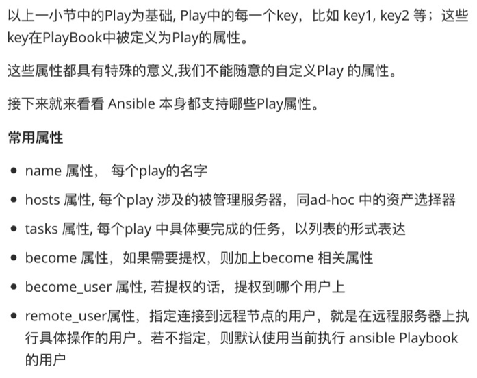

1. tasks 属性中任务的多种写法




下面是一个含有一个 play 的 Playbook：

```javascript
# example-task-playbook.yaml
---
- name: the first play example
  hosts: all
  remote_user: root
  tasks:
    - name: install nginx package
      # present 表示如果这个软件已经安装,那么这个软件不安装也不升级;没有这个软件就安装上
      yum: name=nginx state=present
    - name: copy nginx.conf to remote server
      copy: src=nginx.conf dest=/etc/nginx/nginx.conf
    - name: start nginx server
      systemd:
        name: nginx
        enabled: true
        state: started
```


下面是一个含有多个 play 的 Playbook：

```javascript
# example-task-multiple-playbook.yaml
---
- name: the first play example
  hosts: master
  remote_user: root
  tasks:
    - name: install nginx package
      yum: name=nginx state=present
    - name: copy nginx.conf to remote server
      copy: src=nginx.conf dest=/etc/nginx/nginx.conf
    - name: start nginx server
      systemd:
        name: nginx
        enabled: true
        state: started
- name: manager node servers
  hosts: node
  tasks:
    - name: update database config
      copy: src=my.cnf dest=/etc/my/cnf
```


2. tasks 属性中任务的多种写法

```javascript
# 以启动 nginx 服务,并增加开机启动为例
# 一行的形式:
systemd: name = nginx  enabled=true state=started

# 多行的形式:
systemd: name=nginx
         enabled=true
         state=started

# 多行写成字典的形式:
systemd:
  name: nginx
  enabled: true
  state: started
```


