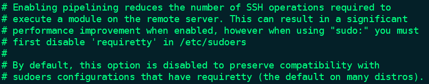

1. SSH Pipeline (注意：这个pipeline是ssh的功能)

```javascript
[root@localhost ~]# ansible-playbook -i hosts checkhosts-one.yml --limit master -vvv
ansible-playbook 2.9.27
  config file = /etc/ansible/ansible.cfg
  configured module search path = [u'/r
 //...... 
```

从上面的调试信息可以看出，执行一条命令中间会有很多操作，比如和主机的三次握手、四次挥手，以及在过程中还有 put 、创建这些操作，为了减少这种流程，可以开启 ssh 的 Pipeline。这个时候传文件就会在ssh会话中直接传过去了，就不会再去put 以及创建这些 (相当于不传文件就执行命令，这样性能就更好)，使用管道可以减少执行远程过程中模块所需要的网络操作数。


2. 开启 SSH Pipeline 

```javascript
cat /etc/ansible/ansible.cfg
//......
#pipelining = False
//......

配置文件中改为如下：
pipelining = True
```

开启 pipelinin 要注意：当使用“sudo:”时，必须首先在远程主机 /etc/sudoers 中禁用 'requiretty'，不用 sudo 就不用管它，所以开启 pipelinin 对 sudo 命令有影响。对此文档中也有说明，如下：




```javascript
// 再次运行如下命令可以看到已经没有了 put 那些操作
[root@localhost ~]# ansible-playbook -i hosts checkhosts-one.yml --limit master -vvv
//......
```


