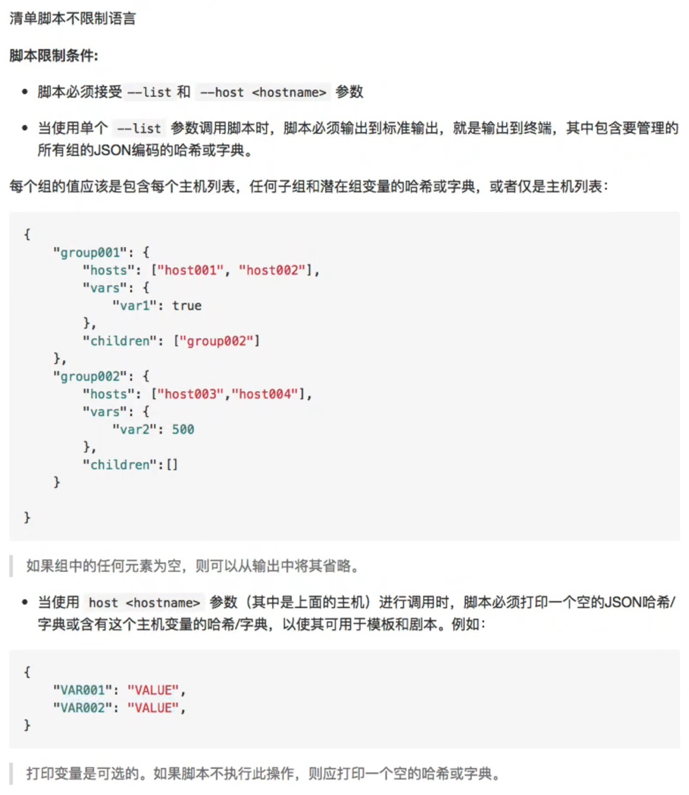

1. 使用 Inventory script



示例脚本文件：get_hosts.py

```javascript
#!/usr/bin/env python
# -*- coding: utf-8 -*-

import sys
import json
# argparse 模块可以处理参数
import argparse

def lists():
    """
    indent 定义输出时的格式缩进的空格数
    """
    dic = {}
    # range(99,100) 包含99,不包含100
    host_list = ['192.168.32.{}'.format(str(i)) for i in range(99,100)]
    host_dict = {'hosts': host_list}
    # 静态文件中的组,在这里定义了主机信息
    dic['computes'] = host_dict
    return json.dumps(dic, indent=4)

def hosts(name):
    dic = {'ansible_ssh_pass': 'admin000'}
    return json.dumps(dic)

# 指定脚本通用的语法,当这个文件被作为执行文件执行的时候,而不是作为模块导入的时候，—__name__ 的变量值就会等于 __main__
if __name__ == '__main__':
    parser = argparse.ArgumentParser()
    # action='store'是固定写法
    parser.add_argument('-l', '--list', help='host list', action='store_true')
    parser.add_argument('-H', '--host', help='host vars')
    args = vars(parser.parse_args())

    if args['list']:
        print(lists())
    elif args['host']:
        print(hosts(args['host']))
    else:
        parser.print_help()
```


```javascript
注意事项：
1.脚本第一行"#!/usr/bin/env python":
  表示:当执行 env python 时，它其实会去 env | grep PATH 里(也就是 /usr/local/sbin:/usr/local/bin:/usr/sbin:/usr/bin:/root/bin)这几个路径里去依次查找名为python的可执行文件
  参考资料: https://blog.csdn.net/weixin_36338224/article/details/108947194  

2.如果没有在第一行指定解释器,每次运行脚本都需要在命令行中指定,比如 "python get_hosts.py"

3.如果脚本在window上创建,linux上执行,并且指定了"#!/usr/bin/env python", 运行时出现如下错误：
	[root@localhost ~]# ./get_hosts.py 
	: No such file or directory
原因一般是换行符问题,只要把文件中的window换行符改为linux换行符就可以
如果是window换行符,只能以 "python get_hosts.py" 这种方式运行脚本
参考资料：https://blog.csdn.net/NiYintang/article/details/86124338

4.使用 cp 拷贝时, 加上 -a 参数, 这样可以保证拷贝后还是有执行权限,例如:
	cp -a get_hosts.py /inventory-var-group-script```


```javascript
// 改变权限
[root@localhost ~]# chmod +x get_hosts.py

// 对应执行脚本中的 "parser.print_help()" 代码
[root@localhost ~]# ./get_hosts.py 
usage: get_hosts.py [-h] [-l] [-H HOST]

optional arguments:
  -h, --help            show this help message and exit
  -l, --list            host list
  -H HOST, --host HOST  host vars
	
// 获取主机的变量
[root@localhost ~]# ./get_hosts.py -H 192.168.32.100
{"ansible_ssh_pass": "admin123"}
[root@localhost ~]# ./get_hosts.py -H 192.168.32.99
{"ansible_ssh_pass": "admin123"}

// 列出所有主机信息
[root@localhost ~]# ./get_hosts.py -l
{
    "computes": {
        "hosts": [
            "192.168.32.99"
        ]
    }
}

// 使用 ansible 或 ansible-book 命令
[root@localhost ~]# ansible all -i get_hosts.py --list-host
  hosts (1):
    192.168.32.99
```


2. 将脚本和静态资产混合使用

```javascript
# cat 01-static
[master]
192.168.32.100
#192.168.32.[100-110] # 也可以用这种方式连续指定多台主机

[allHosts:children]
master

[allHosts:vars]
name=static-01-vars
---------------------------------文件分割线---------------------------------
# cat 02-static
[node]
192.168.32.101

[allHosts:children]
node

[allHosts:vars]
name=static-02-vars
---------------------------------文件分割线---------------------------------
# cat all.yml
name: varInAll
---------------------------------文件分割线---------------------------------
# cat get_hosts.py
// 省略......
```


```javascript
[root@localhost ~]# mv inventory-var-group inventory-var-group-script
[root@localhost ~]# cp get_hosts.py inventory-var-group-script/
[root@localhost ~]# tree inventory-var-group-script/
inventory-var-group-script/
├── 01-static
├── 02-static
├── get_hosts.py
└── group_vars
    └── all.yml

1 directory, 4 files
```


```javascript
[root@localhost ~]# ansible all -i inventory-var-group-script/ --list-host
  hosts (3):
    192.168.32.99
    192.168.32.100
    192.168.32.101
[root@localhost ~]#
```


这就是使用脚本混合的 inventory，这个脚本只是个简单示例，后期可以根据业务的实际场景进行修改。


3. python 命令行使用示例：

```javascript
[root@localhost ~]# python
Python 2.7.5 (default, Oct 14 2020, 14:45:30) 
[GCC 4.8.5 20150623 (Red Hat 4.8.5-44)] on linux2
Type "help", "copyright", "credits" or "license" for more information.
>>> dic={}
>>> host_list=["192.0168.32.99","192.0168.32.100","192.0168.32.101"]
>>> hosts_dict={"hosts": host_list}
>>> hosts_dict
{'hosts': ['192.0168.32.99', '192.0168.32.100', '192.0168.32.101']}
>>> dic["computes"] = hosts_dict
>>> import json
>>> json.dumps(dic)
'{"computes": {"hosts": ["192.0168.32.99", "192.0168.32.100", "192.0168.32.101"]}}'
>>> json.dumps(dic, indent=4)
'{\n    "computes": {\n        "hosts": [\n            "192.0168.32.99", \n            "192.0168.32.100", \n            "192.0168.32.101"\n        ]\n    }\n}'
>>> print json.dumps(dic, indent=4)
{
    "computes": {
        "hosts": [
            "192.0168.32.99", 
            "192.0168.32.100", 
            "192.0168.32.101"
        ]
    }
}
>>> import argparse
>>> parser = argparse.ArgumentParser()
>>> parser
ArgumentParser(prog='', usage=None, description=None, version=None, formatter_class=<class 'argparse.HelpFormatter'>, conflict_handler='error', add_help=True)
>>> parser.add_argument('-l', '--list', help='host list', action='store_true')
_StoreTrueAction(option_strings=['-l', '--list'], dest='list', nargs=0, const=True, default=False, type=None, choices=None, help='host list', metavar=None)
>>> parser.add_argument('-H', '--host', help='host vars')
_StoreAction(option_strings=['-H', '--host'], dest='host', nargs=None, const=None, default=None, type=None, choices=None, help='host vars', metavar=None)
>>> args = vars(parser.parse_args())
>>> args
{'host': None, 'list': False}
>>> exit()
```

