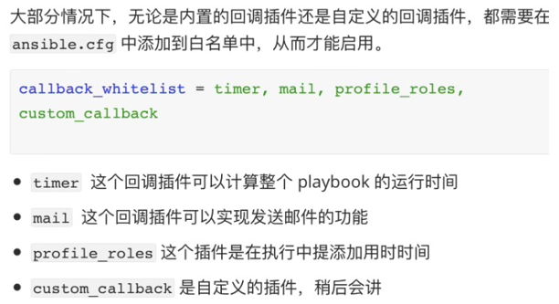

1. 启用其他内置回调插件可以在输出中增加更多的信息和内容



注意：mail 这个功能有点繁琐，感兴趣可以自己尝试用 python 开发，这个内置 mail 插件只能发送到本地主机。timer 和 profile_roles 这两个回调都有用。  


2. 测试：

(1) 测试前把上节修改的配置文件内容还原

```javascript
// 在 /etc/ansible/ansible.cfg 中还原上节修改的配置(注释掉就好),效果如下:
#stdout_callback = json
#bin_ansible_callbacks = True
```


(2) 修改  ansible 配置文件中的 callback_whitelist 属性

```javascript
// 将 /etc/ansible/ansible.cfg 中的 callback_whitelist 修改为如下:
callback_whitelist = timer
```

```javascript
[root@localhost ~]# ansible-playbook -i hosts remoteDate.yml --limit 192.168.32.100

PLAY [all] **********************************************************************************************************************************************************************

TASK [remote date] **************************************************************************************************************************************************************
changed: [192.168.32.100]

PLAY RECAP **********************************************************************************************************************************************************************
192.168.32.100             : ok=1    changed=1    unreachable=0    failed=0    skipped=0    rescued=0    ignored=0   

Playbook run took 0 days, 0 hours, 0 minutes, 0 seconds

// 可以发现最后一行就是用时信息,因为是毫秒级的,立马就返回,所以是 0 seconds
```


为了让效果更明显，重新使用一个 play-book，如下：

```javascript
# cat sleep.yml
- hosts: all
  gather_facts: no
  tasks:
    - name: sleep 2 seconds
      shell: sleep 2
```

```javascript
[root@localhost ~]# ansible-playbook -i hosts2 sleep.yml --limit 192.168.32.100 

PLAY [all] **********************************************************************************************************************************************************************

TASK [sleep 2 seconds] **********************************************************************************************************************************************************
changed: [192.168.32.100]

PLAY RECAP **********************************************************************************************************************************************************************
192.168.32.100             : ok=1    changed=1    unreachable=0    failed=0    skipped=0    rescued=0    ignored=0   

Playbook run took 0 days, 0 hours, 0 minutes, 2 seconds

// 可以看到耗时 2 seconds, 如果获取gather_facts(没有缓存的情况下)会耗时更长 
```


(3) 继续修改  ansible 配置文件中的 callback_whitelist 属性

```javascript
// 将 /etc/ansible/ansible.cfg 中的 callback_whitelist 修改为如下:
callback_whitelist = timer,profile_roles

// 注意：因为 profile_roles 和 profile_tasks 都一样,所以上面的配置等价于:
callback_whitelist = timer,profile_tasks    
```

```javascript
[root@localhost ~]# ansible-playbook -i hosts2 sleep.yml --limit 192.168.32.100 

PLAY [all] **********************************************************************************************************************************************************************
Monday 09 May 2022  14:12:43 -0400 (0:00:00.032)       0:00:00.032 ************ 

TASK [sleep 2 seconds] **********************************************************************************************************************************************************
changed: [192.168.32.100]

PLAY RECAP **********************************************************************************************************************************************************************
192.168.32.100             : ok=1    changed=1    unreachable=0    failed=0    skipped=0    rescued=0    ignored=0   

Monday 09 May 2022  14:12:45 -0400 (0:00:02.392)       0:00:02.425 ************ 
=============================================================================== 
shell ------------------------------------------------------------------- 2.39s
~~~~~~~~~~~~~~~~~~~~~~~~~~~~~~~~~~~~~~~~~~~~~~~~~~~~~~~~~~~~~~~~~~~~~~~~~~~~~~~ 
total ------------------------------------------------------------------- 2.39s
Playbook run took 0 days, 0 hours, 0 minutes, 2 seconds

// 可以发现每个tasks都有启动时间
```


3. 获取帮助


```javascript
// 查看当前可用的回调插件列表, 注意如下:
//   自定义插件只有配置在 callback_whitelist 中才能通过这个命令查看
//   内部插件不管有没有配置都能通过这个命令查看
ansible-doc -t callback -l

```

