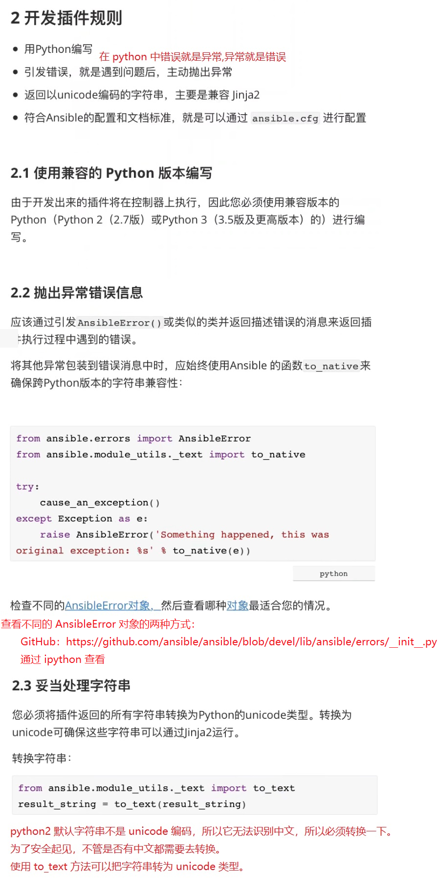
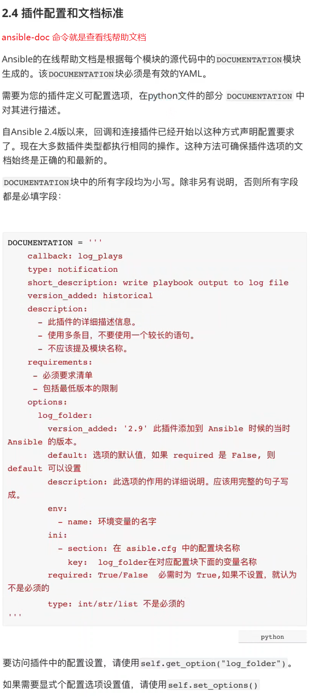
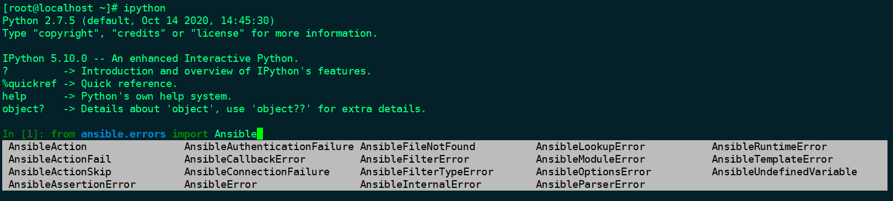

1. 补充：查看不同的 AnsibleError 对象的两种方式：

方式1: 通过 ansible 的 github 查看

```javascript
// 
https://github.com/ansible/ansible/blob/devel/lib/ansible/errors/__init__.py
```


方式2: 通过 ipython 查看




2. 参考资料：

```javascript
python字符串编号_Python字符串编码
https://blog.csdn.net/weixin_33578569/article/details/112891493
```


