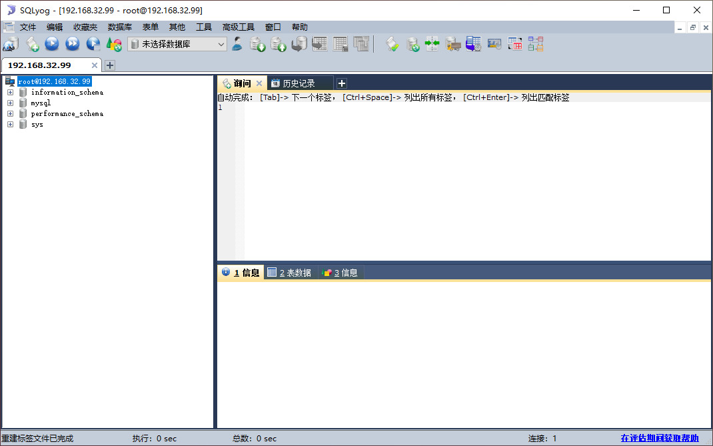

1. 在本机 centos 7 上安装 mysql 5.7


1.1 下载安装包

```javascript
// 查看系统是32还是64位
[root@localhost ~]# uname -a
Linux localhost.localdomain 3.10.0-1160.el7.x86_64 #1 SMP Mon Oct 19 16:18:59 UTC 2020 x86_64 x86_64 x86_64 GNU/Linux

// 从上面可知,系统是64位,所以要对应下载64位的mysql
// 这里使用 mysql 5.7,下载地址为：https://dev.mysql.com/downloads/mysql/5.7.html

[root@localhost ~]# cd /
[root@localhost /]# mkdir tool
[root@localhost /]# ls
bin  boot  dev  etc  home  lib  lib64  media  mnt  opt  proc  root  run  sbin  srv  sys  tmp  tool  usr  var

// 将 mysql 安装包下载后上传到 linux 的 "/tool"目录,并解压
[root@localhost tool]# ls
mysql-5.7.38-linux-glibc2.12-x86_64.tar
[root@localhost tool]# tar -xf mysql-5.7.38-linux-glibc2.12-x86_64.tar 
[root@localhost tool]# ls
mysql-5.7.38-linux-glibc2.12-x86_64.tar     mysql-test-5.7.38-linux-glibc2.12-x86_64.tar.gz
mysql-5.7.38-linux-glibc2.12-x86_64.tar.gz
```


1.2 检查系统是否安装过mysql

```javascript
// 检查系统是否安装过mysql,运行下面命令后如果什么都没有,说明没有安装过
[root@localhost tool]# rpm -qa|grep mysql
// 如果系统自带mysql，查询所有mysql 对应的文件夹，全部删除
[root@localhost tool]# whereis mysql
mysql: /usr/lib64/mysql /usr/share/mysql
[root@localhost tool]# find / -name mysql
/etc/selinux/targeted/active/modules/100/mysql
/usr/lib/python2.7/site-packages/ansible/modules/database/mysql
/usr/lib64/mysql
/usr/share/mysql

// 注意:
//	不要删除 /usr/lib/python2.7/site-packages/ansible/modules/database/mysql
//	这个是 ansible 使用 mysql 时需要的文件
[root@localhost tool]# rm -rf /etc/selinux/targeted/active/modules/100/mysql
[root@localhost tool]# rm -rf /usr/lib64/mysql
[root@localhost tool]# rm -rf /usr/share/mysql


```


1.3 卸载CentOS7系统自带mariadb

```javascript
[root@localhost tool]# rpm -qa|grep mariadb
mariadb-libs-5.5.68-1.el7.x86_64

// 卸载 mariadb
[root@localhost tool]# rpm -e --nodeps mariadb-libs-5.5.68-1.el7.x86_64
warning: file /usr/share/mysql/ukrainian/errmsg.sys: remove failed: No such file or directory
warning: file /usr/share/mysql/ukrainian: remove failed: No such file or directory
warning: file /usr/share/mysql/swedish/errmsg.sys: remove failed: No such file or directory
warning: file /usr/share/mysql/swedish: remove failed: No such file or directory
//......

// 如果etc目录下有 my.cnf 文件,一定要删掉,等下再重新建,如果使用这个文件,后面改配置各种不生效
// 因为本机目录下没有my.cnf文件,所以这里直接跳过
// rm /etc/my.cnf

```


1.4 检查有无安装过mysql 用户组，没有的话创建

```javascript
[root@localhost tool]# cat /etc/group | grep mysql
[root@localhost tool]# cat /etc/passwd |grep mysql

[root@localhost tool]# groupadd mysql
[root@localhost tool]# useradd -r -g mysql mysql
```


1.5 安装mysql5.7

```javascript
[root@localhost tool]# mkdir /usr/local/mysql

// 将 mysql-5.7.38-linux-glibc2.12-x86_64.tar.gz 解压到 "/usr/local/mysql"
[root@localhost tool]# tar -zxvf mysql-5.7.38-linux-glibc2.12-x86_64.tar.gz -C /usr/local/mysql
mysql-5.7.38-linux-glibc2.12-x86_64/bin/myisam_ftdump
mysql-5.7.38-linux-glibc2.12-x86_64/bin/myisamchk
mysql-5.7.38-linux-glibc2.12-x86_64/bin/myisamlog
//......

[root@localhost tool]# ls /usr/local/mysql/
mysql-5.7.38-linux-glibc2.12-x86_64

//修改 mysql-5.7.38-linux-glibc2.12-x86_64 文件夹名称为 mysql5.7
[root@localhost tool]# ls /usr/local/mysql
mysql5.7

// 更改mysql5.7 目录下所有文件夹所属的用户组、用户以及权限
[root@localhost tool]# chown -R mysql:mysql /usr/local/mysql/mysql5.7
[root@localhost tool]# chmod -R 755 /usr/local/mysql/mysql5.7

//进入"/usr/local/mysql/mysql5.7/bin/"目录
[root@localhost tool]# cd /usr/local/mysql/mysql5.7/bin

// 编译安装并初始化mysql
// 注意:务必记住数据库管理员临时密码,最后一行末尾的"R.o?0Hhg-8:l"就是数据库管理员临时密码
[root@localhost bin]# ./mysqld --initialize --user=mysql --datadir=/usr/local/mysql/mysql5.7/data --basedir=/usr/local/mysql/mysql5.7
2022-05-12T06:17:00.888713Z 0 [Warning] TIMESTAMP with implicit DEFAULT value is deprecated. Please use --explicit_defaults_for_timestamp server option (see documentation for more details).
2022-05-12T06:17:01.087922Z 0 [Warning] InnoDB: New log files created, LSN=45790
2022-05-12T06:17:01.147585Z 0 [Warning] InnoDB: Creating foreign key constraint system tables.
2022-05-12T06:17:01.233744Z 0 [Warning] No existing UUID has been found, so we assume that this is the first time that this server has been started. Generating a new UUID: 22aa95fa-d1bb-11ec-87b2-000c2930c409.
2022-05-12T06:17:01.235276Z 0 [Warning] Gtid table is not ready to be used. Table 'mysql.gtid_executed' cannot be opened.
2022-05-12T06:17:01.526754Z 0 [Warning] A deprecated TLS version TLSv1 is enabled. Please use TLSv1.2 or higher.
2022-05-12T06:17:01.526769Z 0 [Warning] A deprecated TLS version TLSv1.1 is enabled. Please use TLSv1.2 or higher.
2022-05-12T06:17:01.527419Z 0 [Warning] CA certificate ca.pem is self signed.
2022-05-12T06:17:01.719154Z 1 [Note] A temporary password is generated for root@localhost: R.o?0Hhg-8:l

// 编写etc目录下的 my.cnf 配置文件
# vi /etc/my.cnf  // 添加如下配置
[mysqld]
datadir=/usr/local/mysql/mysql5.7/data
port = 3306
sql_mode=NO_ENGINE_SUBSTITUTION,STRICT_TRANS_TABLES
symbolic-links=0
max_connections=400
innodb_file_per_table=1
# lower_case_table_names 值设为 1 表示表名大小写不敏感
lower_case_table_names=1

// 授予 my.cnf 配置文件775权限
[root@localhost bin]# chmod -R 775 /etc/my.cnf


// 注意:如果mysql没有安装到"/usr/local/mysql"目录,需要修改"/{安装目录}/mysql5.7/support-files/mysql.server"文件
// 本机mysql的安装目录为"/usr/local/mysql/mysql5.7", 所以需要修改"mysql.server"文件中以下五个字段的路径
[root@localhost tool]# cat /usr/local/mysql/mysql5.7/support-files/mysql.server | grep /usr/local/mysql
# If you install MySQL on some other places than /usr/local/mysql, then you
  basedir=/usr/local/mysql
  bindir=/usr/local/mysql/bin
    datadir=/usr/local/mysql/data
  sbindir=/usr/local/mysql/bin
  libexecdir=/usr/local/mysql/bin

# vi /usr/local/mysql/mysql5.7/support-files/mysql.server 

// 改后为:
[root@localhost tool]# cat /usr/local/mysql/mysql5.7/support-files/mysql.server | grep /usr/local/mysql
# If you install MySQL on some other places than /usr/local/mysql, then you
  basedir=/usr/local/mysql/mysql5.7
  bindir=/usr/local/mysql/mysql5.7/bin
    datadir=/usr/local/mysql/mysql5.7/data
  sbindir=/usr/local/mysql/mysql5.7/bin
  libexecdir=/usr/local/mysql/mysql5.7/bin
[root@localhost tool]#
```


1.6 启动 mysql 服务

```javascript
// 查询服务
[root@localhost bin]# ps -ef|grep mysql
root       4993   1585  0 02:36 pts/0    00:00:00 grep --color=auto mysql
[root@localhost bin]# ps -ef|grep mysqld
root       5003   1585  0 02:36 pts/0    00:00:00 grep --color=auto mysqld

// 启动服务
[root@localhost tool]# /usr/local/mysql/mysql5.7/support-files/mysql.server start
Starting MySQL.Logging to '/usr/local/mysql/mysql5.7/data/localhost.localdomain.err'.
 SUCCESS!
 
// 添加软连接,并重启mysql 服务
[root@localhost tool]# ln -s /usr/local/mysql/mysql5.7/support-files/mysql.server /etc/init.d/mysql
[root@localhost tool]# ln -s /usr/local/mysql/mysql5.7/bin/mysql /usr/bin/mysql
// 重启mysql服务
[root@localhost tool]# service mysql restart
Shutting down MySQL.. SUCCESS! 
Starting MySQL. SUCCESS! 

```


1.7 等录 mysql，修改密码，开放远程连接

```javascript
// 登录mysql, 密码就是初始化时生成的临时密码, 这里临时密码为 R.o?0Hhg-8:l
[root@localhost tool]# mysql -u root -p
Enter password: 
Welcome to the MySQL monitor.  Commands end with ; or \g.
Your MySQL connection id is 4
Server version: 5.7.38

Copyright (c) 2000, 2022, Oracle and/or its affiliates.

Oracle is a registered trademark of Oracle Corporation and/or its
affiliates. Other names may be trademarks of their respective
owners.

Type 'help;' or '\h' for help. Type '\c' to clear the current input statement.
// 修改密码为root
mysql> set password for root@localhost = password('root');
Query OK, 0 rows affected, 1 warning (0.00 sec)
// 运行下面三个 mysql 命令表示开放远程连接
mysql> use mysql;
Reading table information for completion of table and column names
You can turn off this feature to get a quicker startup with -A

Database changed
mysql> update user set user.Host='%' where user.User='root';
Query OK, 1 row affected (0.00 sec)
Rows matched: 1  Changed: 1  Warnings: 0

mysql> flush privileges;
Query OK, 0 rows affected (0.00 sec)

mysql> exit
Bye
```


1.8 设置开机启动 mysql

```javascript
// 将服务文件拷贝到 init.d 下,并重命名为mysql
[root@localhost tool]# cp /usr/local/mysql/mysql5.7/support-files/mysql.server /etc/init.d/mysqld

// 赋予可执行权限
[root@localhost tool]# chmod +x /etc/init.d/mysqld

//添加服务
[root@localhost tool]# chkconfig --add mysqld

//显示服务列表
[root@localhost tool]# chkconfig --list

Note: This output shows SysV services only and does not include native
      systemd services. SysV configuration data might be overridden by native
      systemd configuration.

      If you want to list systemd services use 'systemctl list-unit-files'.
      To see services enabled on particular target use
      'systemctl list-dependencies [target]'.

mysqld         	0:off	1:off	2:on	3:on	4:on	5:on	6:off
netconsole     	0:off	1:off	2:off	3:off	4:off	5:off	6:off
network        	0:off	1:off	2:on	3:on	4:on	5:on	6:off 
```


1.9 开放3306端口，测试本地客户端是否连接成功

```javascript
//开放3306端口命令
[root@localhost tool]# firewall-cmd --zone=public --add-port=3306/tcp --permanent
success

//配置立即生效
[root@localhost tool]# firewall-cmd --reload
success

```





参考文档：

```javascript
centos7安装mysql5.7步骤（图解版）
https://blog.csdn.net/li1325169021/article/details/121515102

MySQL 下载地址:
https://dev.mysql.com/downloads/mysql/5.7.html

centos没装过mysql为何会有mysql配置文件？
因为系统里有依赖MySQL的程序，这些程序会使用MySQL的这些lib运行库
```


2. 创建表以及创建Mysql用户并授权

```javascript
[root@localhost ~]# mysql -u root -p
Enter password: 
Welcome to the MySQL monitor.  Commands end with ; or \g.
Your MySQL connection id is 2
Server version: 5.7.38 MySQL Community Server (GPL)

Copyright (c) 2000, 2022, Oracle and/or its affiliates.

Oracle is a registered trademark of Oracle Corporation and/or its
affiliates. Other names may be trademarks of their respective
owners.

Type 'help;' or '\h' for help. Type '\c' to clear the current input statement.
// 创建一个名为 ansible 的数据库
mysql> create database if not exists ansible default charset utf8mb4 collate utf8mb4_general_ci;
Query OK, 1 row affected (0.00 sec)
// 创建一个用户为 ansible 的 mysql 用户, 密码也为 ansible
mysql> CREATE USER 'ansible'@'%' IDENTIFIED BY 'ansible';
Query OK, 0 rows affected (0.00 sec)
// ansible 这个用户对 ansible 这个数据库具有所有权限,并且所有的机器都可以通过用户名为 ansible, 密码为 ansible 进行远程访问
mysql> GRANT all ON ansible.* TO 'ansible'@'%' IDENTIFIED BY 'ansible';
Query OK, 0 rows affected, 1 warning (0.00 sec)
// 查看 ansible 这个用户具有的权限
mysql> show grants for ansible
    -> ;
+------------------------------------------------------+
| Grants for ansible@%                                 |
+------------------------------------------------------+
| GRANT USAGE ON *.* TO 'ansible'@'%'                  |
| GRANT ALL PRIVILEGES ON `ansible`.* TO 'ansible'@'%' |
+------------------------------------------------------+
2 rows in set (0.00 sec)
// 创建表
mysql> use ansible
Database changed
mysql> create table playsresult(
    -> id int auto_increment primary key,
    -> user varchar(16) not null,
    -> host varchar(32) not null,
    -> category varchar(11) not null,
    -> result text,
    -> create_time datetime NOT NULL DEFAULT CURRENT_TIMESTAMP
    -> );
Query OK, 0 rows affected (0.01 sec)

mysql> show tables;
+-------------------+
| Tables_in_ansible |
+-------------------+
| playsresult       |
+-------------------+
1 row in set (0.00 sec)

mysql> exit
Bye
[root@localhost ~]# 
```


扩展:

```javascript
// 建表
create database if not exists ansible default charset utf8mb4 collate utf8mb4_general_ci;
// 给 mysql 创建用户
CREATE USER 'ansible'@'%' IDENTIFIED BY 'ansible';
// ansible 这个用户对 ansible 这个数据库具有所有权限,并且所有的机器都可以通过用户名为 ansible, 密码为 ansible 进行远程访问
GRANT all ON ansible.* TO 'ansible'@'%' IDENTIFIED BY 'ansible';
// 建表
create table playsresult(
id int auto_increment primary key,
user varchar(16) not null,
host varchar(32) not null,
category varchar(11) not null,
result text,
create_time datetime NOT NULL DEFAULT CURRENT_TIMESTAMP
);


// 授权示例： 
//  使用以下授权语句，将授权指定的192.168.1.1 和192.168.1.2 的机器，使用用户名为root，密码为test123的用户访问
//    grant all privileges on *.* to 'root'@'192.168.1.1' identified by 'test123'; 
//    grant all privileges on *.* to 'root'@'192.168.1.2' identified by 'test123';
//  如果要让所有的主机都能访问,就使用通配符'%'代表主机,如下:
//    grant all privileges on *.* to 'root'@'%' identified by 'test123';

参考资料如下:
   mysql 创建用户命令-grant:
   https://blog.csdn.net/mickey1554/article/details/106117110/
```

