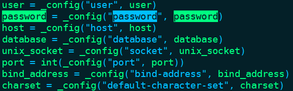
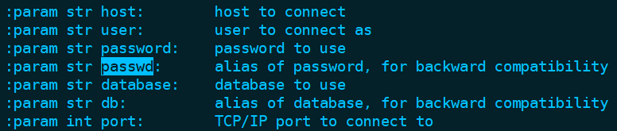

1. python 的 try 语法块的使用示例

python 在使用 mysql 的时候需要用到 pymysql 包或 mysqlclient 包（这个包的模块名称为 MySQLdb），这里就使用导入包为例来说明 python 的 try 语法块的使用。

```javascript
[root@localhost ~]# ipython
Python 2.7.5 (default, Oct 14 2020, 14:45:30) 
Type "copyright", "credits" or "license" for more information.

IPython 5.10.0 -- An enhanced Interactive Python.
?         -> Introduction and overview of IPython's features.
%quickref -> Quick reference.
help      -> Python's own help system.
object?   -> Details about 'object', use 'object??' for extra details.

In [1]: from ansible.errors import AnsibleError
   ...: 
   ...: try:
   ...:     import pymysql
   ...: except ImportError as e:
   ...:     print e
   ...:     print("import pymysql error")
   ...:     try:
   ...:         import MySQLdb
   ...:     except ImportError as e:
   ...:         print(str(e) + " ===========> import MySQLdb error")
   ...:         raise AnsibleError("找不到 pymysql 或者 MySQLdb 模块")
   ...:     
No module named pymysql
import pymysql error
No module named MySQLdb ===========> import MySQLdb error
---------------------------------------------------------------------------
AnsibleError                              Traceback (most recent call last)
<ipython-input-1-55bd06d6e8af> in <module>()
     10     except ImportError as e:
     11         print(str(e) + " ===========> import MySQLdb error")
---> 12         raise AnsibleError("找不到 pymysql 或者 MySQLdb 模块")
     13 

AnsibleError: 找不到 pymysql 或者 MySQLdb 模块

In [2]: exit
[root@localhost ~]#
```

raise 表示主动抛出异常，这个异常类可以使用一个内部的或从外部导入的错误类，ansible 建议导入它自己的错误类，然后抛出异常。


2. 用 pip 安装 pymysql  包和 mysqlclient 包（这个包的模块名称为 MySQLdb）


2.1 因为当前 pip(包管理工具) 版本低，所以需要在"https://pypi.org"找低版本的 pymysql 包和 mysqlclient 包安装

```javascript
// 安装 pymysql 
[root@localhost ~]# pip install PyMySQL==1.0.2
Collecting PyMySQL==1.0.2
  Could not find a version that satisfies the requirement PyMySQL==1.0.2 (from versions: 0.3, 0.4, 0.5, 0.6, 0.6.1, 0.6.2, 0.6.3, 0.6.4.dev1, 0.6.4, 0.6.6, 0.6.7, 0.7.0, 0.7.1, 0.7.2, 0.7.3, 0.7.4, 0.7.5, 0.7.6, 0.7.7, 0.7.8, 0.7.9, 0.7.10, 0.7.11, 0.8.0, 0.8.1, 0.9.0, 0.9.1, 0.9.2, 0.9.3, 0.10.0, 0.10.1, 1.0.0)
No matching distribution found for PyMySQL==1.0.2
You are using pip version 9.0.1, however version 22.1 is available.
You should consider upgrading via the 'pip install --upgrade pip' command.
[root@localhost ~]# pip install PyMySQL==0.9.0
Collecting PyMySQL==0.9.0
  Downloading https://files.pythonhosted.org/packages/2f/be/4310bb405eb83b615cf9bd4501942d9ff000d8b9372ce84e920facbf5c36/PyMySQL-0.9.0-py2.py3-none-any.whl (84kB)
    100% |████████████████████████████████| 92kB 107kB/s 
Requirement already satisfied: cryptography in /usr/lib64/python2.7/site-packages (from PyMySQL==0.9.0)
Requirement already satisfied: idna>=2.0 in /usr/lib/python2.7/site-packages (from cryptography->PyMySQL==0.9.0)
Requirement already satisfied: pyasn1>=0.1.8 in /usr/lib/python2.7/site-packages (from cryptography->PyMySQL==0.9.0)
Requirement already satisfied: six>=1.4.1 in /usr/lib/python2.7/site-packages (from cryptography->PyMySQL==0.9.0)
Requirement already satisfied: setuptools in /usr/lib/python2.7/site-packages (from cryptography->PyMySQL==0.9.0)
Requirement already satisfied: enum34 in /usr/lib/python2.7/site-packages (from cryptography->PyMySQL==0.9.0)
Requirement already satisfied: ipaddress in /usr/lib/python2.7/site-packages (from cryptography->PyMySQL==0.9.0)
Requirement already satisfied: cffi>=1.4.1 in /usr/lib64/python2.7/site-packages (from cryptography->PyMySQL==0.9.0)
Requirement already satisfied: pycparser in /usr/lib/python2.7/site-packages (from cffi>=1.4.1->cryptography->PyMySQL==0.9.0)
Installing collected packages: PyMySQL
Successfully installed PyMySQL-0.9.0
You are using pip version 9.0.1, however version 22.1 is available.
You should consider upgrading via the 'pip install --upgrade pip' command.
[root@localhost ~]#

// 没有抛出异常,说明安装成功
[root@localhost ~]# ipython
Python 2.7.5 (default, Oct 14 2020, 14:45:30) 
Type "copyright", "credits" or "license" for more information.

IPython 5.10.0 -- An enhanced Interactive Python.
?         -> Introduction and overview of IPython's features.
%quickref -> Quick reference.
help      -> Python's own help system.
object?   -> Details about 'object', use 'object??' for extra details.

In [1]: from ansible.errors import AnsibleError
   ...: try:
   ...:     import pymysql
   ...: except ImportError as e:
   ...:     raise AnsibleError("找不到 pymysql 模块  =========>>" + str(e))
   ...: 

In [2]: exit
[root@localhost ~]# 
```


```javascript
// 首先安装 mysql-devel 和 python-devel, 编译时需要用到这两个开发包
//    mysql-devel 开发用到的库以及包含文件
//    python-devel 开发用到的库以及包含文件

[root@localhost ~]# yum install mysql-devel
// 省略......

[root@localhost ~]# yum install python-devel
// 省略......

// 安装 mysqlclient 
[root@localhost ~]# pip install mysqlclient==1.3.14
Collecting mysqlclient==1.3.14
  Using cached https://files.pythonhosted.org/packages/f7/a2/1230ebbb4b91f42ad6b646e59eb8855559817ad5505d81c1ca2b5a216040/mysqlclient-1.3.14.tar.gz
Installing collected packages: mysqlclient
  Running setup.py install for mysqlclient ... done
Successfully installed mysqlclient-1.3.14
You are using pip version 9.0.1, however version 22.1 is available.
You should consider upgrading via the 'pip install --upgrade pip' command.

// 没有抛出异常,说明安装成功
[root@localhost ~]# ipython
Python 2.7.5 (default, Nov 16 2020, 22:23:17) 
Type "copyright", "credits" or "license" for more information.

IPython 5.10.0 -- An enhanced Interactive Python.
?         -> Introduction and overview of IPython's features.
%quickref -> Quick reference.
help      -> Python's own help system.
object?   -> Details about 'object', use 'object??' for extra details.

In [1]: try:
   ...:     import MySQLdb
   ...: except ImportError as e:
   ...:     raise AnsibleError("找不到 MySQLdb 模块  =========>>" + str(e))
   ...: 

In [2]: exit
[root@localhost ~]#
```


```javascript
参考资料
	centos7安装mysqlclient报错mysql_config not found
	https://blog.csdn.net/IncubusSong/article/details/88416910

	command 'gcc' failed with exit status 1错误问题的解决办法
	https://blog.csdn.net/enweitech/article/details/80728434
```


2.2  pymysql  包 mysqlclient 包的区别

- pymysql  包连接数据库的密码字段名称为 password，mysqlclient 包连接数据库的密码字段名称为 passwd（mysqlclient 包根据版本有所不同，一些老版本只有 passwd 字段，而之后的版本 password 和 passwd 两个字段都有，passwd 可以用来兼容老版本）

- pymysql  包数据库字段名称为 database，mysqlclient 包数据库字段名称为 db （mysqlclient 包根据版本有所不同，一些老版本只有 db 字段，而之后的版本 database 和 db 两个字段都有，db 可以用来兼容老版本）


pymysql： 

```javascript
// pymysql
[root@localhost ~]# ipython
Python 2.7.5 (default, Nov 16 2020, 22:23:17) 
Type "copyright", "credits" or "license" for more information.

IPython 5.10.0 -- An enhanced Interactive Python.
?         -> Introduction and overview of IPython's features.
%quickref -> Quick reference.
help      -> Python's own help system.
object?   -> Details about 'object', use 'object??' for extra details.

In [1]: from pymysql.connections import Connection

In [2]: ??Connection
// 源码截图如下:
```



```javascript
源码位置: /usr/lib/python2.7/site-packages/pymysql/connections.py
```


mysqlclient：

```javascript
// mysqlclient 包模块名为 MySQLdb
[root@localhost ~]# ipython
Python 2.7.5 (default, Nov 16 2020, 22:23:17) 
Type "copyright", "credits" or "license" for more information.

IPython 5.10.0 -- An enhanced Interactive Python.
?         -> Introduction and overview of IPython's features.
%quickref -> Quick reference.
help      -> Python's own help system.
object?   -> Details about 'object', use 'object??' for extra details.

In [1]: from MySQLdb.connections import Connection

In [2]: ??Connection 
// 源码截图如下:
```



```javascript
源码位置: /usr/lib64/python2.7/site-packages/MySQLdb/connections.py
```


3. 自定义插件mysql_plays之处理模块导入逻辑

```javascript
# to_native 方法可以用转换输出(比如抛出异常类的输出),
from ansible.module_utils._text import to_native
from ansible.errors import AnsibleError
try:
    import pymysql as mysqldb
    pwd = "password"
    db = "database"
except ImportError:
    try:
        import MySQLdb as mysqldb
        pwd = "passwd"
        db = "db"
    except ImportError as e:
        # 将其他异常包装到错误消息中时，应始终使用Ansible 的函数 to_native 来确保跨Python版本的字符串兼容性
        raise AnsibleError("找不到 pymysql 或者 MySQLdb 模块。" + "=================>>" + to_native(e))
```


在Python中，如果import的语句比较长，导致后续引用不方便，可以使用as语法。注意：使用as语法之后，只能通过as后面名字来访问导入的moudle。上面代码中使用 "as mysqldb" 是为了统一模块名称，因为在 pymysql  和 MySQLdb 模块中都有 Connection 方法，这样后面就不用加判断。"pwd "也是为了统一变量名称，也是为了后面不用加判断。

```javascript
参考资料：
    from…import * 语句与 import 区别
    https://www.runoob.com/note/26325

    Python中import的as语法
    https://blog.csdn.net/chaoguo1234/article/details/81277589
```

